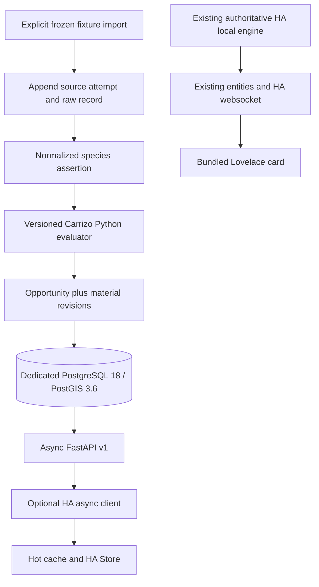

# Photography Events Core — Milestone 1 implementation review

> Historical sections 1–38 describe the first pass. Read the
> [INDEPENDENT REVIEW CORRECTION PASS](#independent-review-correction-pass)
> for current behavior, the independently discovered defects and verified fixes.

Prepared 2026-10-01. This packet describes implemented code and reproducible
evidence, not a production migration. The original specification is preserved
in [docs/IMPLEMENTATION_SPEC_MILESTONE_1.md](docs/IMPLEMENTATION_SPEC_MILESTONE_1.md).

# 1. EXECUTIVE SUMMARY

Created a standalone Core on the existing empty `main` repository: async REST
v1, independent configuration/authentication, explicit PostGIS/Alembic schema,
raw-to-normalized ingestion, a source-controlled Carrizo Tule Elk evaluator,
material decision revisions, source-health projection, scheduler/backoff and
retention frameworks, Docker deployment and operator backup/restore scripts.
Added an isolated HA async client and persisted developer cache. The production
HA engine, card, version 0.16.1 and release state remain unchanged.

The mandatory Tule Elk slice evaluates synthetic logical inputs through new
Core code and compares them with outputs captured by executing the real pinned
HA engine. It does not hard-code expected opportunity JSON. No production
collectors, Unraid deployment, NAS scheduling, HA cutover or public release was
performed. Condor is explicitly deferred below.

Acceptance evidence is recorded in sections 26–31 and the committed
`docs/validation/` snapshots. Runtime acceptance is green at the recorded Core
and HA implementation SHAs: 71 Core tests with real PostGIS, 15 Tule Elk cases,
575 portable HA tests (90 skipped), 127 card tests, and 90 real-HA tests on each
of two compatibility versions. Actual backup/restore scripts passed in CI.

# 2. REPOSITORIES

| Repository | Original main | Final implementation snapshot |
|---|---|---|
| https://github.com/Tmatz27/photography-events-core | Empty repository; no commit existed | `f3aca3172220107e9308c73e2904511484fdad40` |
| https://github.com/Tmatz27/Home-assistant-photography-events | `4905e35c0668c37737d84685e65d2a806f7c92f7` | `7a9d4c6bcf00ffe17b68190a10df4dc83d4db83c` |

Core commits created:

- `2423a18952ccee9ce2ac4afacb53adf70daaffaa`: foundation and Carrizo parity slice.
- `241ea23d3aeedd721210f2352188ca3736130fa9`: private-network acceptance execution and persistent backoff.
- `3e03aa433108aa506c3fc648cf8269c482eb3ba9`: restore extension ownership with administrator privileges.
- `e4014034c3af05379cb6d8ce34fbc47a777d2d64`: execute actual operator scripts and deployment boundary checks.
- `f3aca3172220107e9308c73e2904511484fdad40`: include Compose and operator scripts in the acceptance test image.
- The subsequent documentation commit contains this packet, original specification
  and validation evidence. A Git commit cannot contain its own hash; the exact
  final main tip including this packet is recorded in the delivered submission
  receipt and final response. Resolve the packet commit with
  `git log -1 --format=%H -- IMPLEMENTATION_REVIEW_MILESTONE_1.md`.

HA commits created:

- `b7671408a44315258cf8468c50ac49343399594e`: async client and HA Store developer bridge.
- `7a9d4c6bcf00ffe17b68190a10df4dc83d4db83c`: retain last complete cache across incomplete responses.

Both repositories were cloned and `git pull --ff-only` was attempted before
edits. HA was current. Core had no remote `main` ref yet, so pull correctly
reported no such ref; its first commit created `main`. All pushes were ordinary
fast-forward pushes, without branches, PRs, tags or releases.

# 3. ARCHITECTURE IMPLEMENTED

The optional client/cache has no production coordinator wiring. The card never
connects to Core. Core production startup does not seed fixture data or schedule
live provider requests. SQLAlchemy is used for bounded async SQL and transactions;
the explicit SQL migration is the database model, not a second ORM schema.

# 4. PROMPT DEVIATIONS

| Requested direction | Implemented behavior | Reason and risk |
|---|---|---|
| Tule Elk port | Calendar plus species-presence path, 15 cases | Mandatory meaningful opportunity is reproduced. Legacy free-text behavior-report parsing is not ported; Core must not be described as full Tule Elk feature parity. |
| Condor preferred | Deferred | Independent count/behavior/encounter paths, NPS access dependency and daily occurrence keys deserve their own fixture contract. Details in section 14. |
| Routed baselines calculated/reused | Table, uniqueness and persistence schema only; legacy calibrated estimate remains in slice | No routing credentials/provider activation supplied. Inventing a routed duration would be wrong. Live routing remains a follow-up. |
| HA Core connection | Explicit developer factory/scaffolding only | Permitted by brief; avoids switching the reviewed production engine. No selectable UI backend yet. |
| Source collectors and backoff framework | Async scheduler plus persistent state methods; no registered jobs | M1 permits framework only and forbids new live source families. Collectors must append attempts through their adapter. |
| Retention machinery | Bounded callable sweeper, not a running periodic task | No production collection load yet. An operator must invoke it when enabling ingestion; no claim of automatic cleanup. |
| No-ID dedup design | No semantic dedup for absent IDs | No active provider without stable IDs. Planned source-specific canonical exact-record fingerprint may detect byte-equivalent repeats within an attempt; it must not establish semantic identity across observations. Current absent-ID rows remain separate. |
| Docker/restore demonstration | Performed on GitHub Actions Linux runner | Local Windows host has neither Docker nor WSL. No claim of actual Unraid/NAS validation. |
| Final SHA inside committed packet | Code SHA here, packet tip in delivered receipt | A commit cannot include its own hash. Runtime tree and documentation tip are distinguished explicitly. |

No unrelated legacy logic was fixed. The old 14-day presence cutoff (distinct
from the seven-day behavior-report cutoff) and the original seasonal dates were
preserved and documented. No unsafe legacy behavior was intentionally introduced
or silently corrected during this port.

# 5. FILE INVENTORY

Core created (no existing Core files were modified or deleted):

| Files | Purpose |
|---|---|
| `.gitignore`, `.gitattributes`, `.dockerignore` | Secrets/artifact exclusions and LF normalization |
| `.env.example`, `compose.yaml`, `compose.ci.yaml`, `Dockerfile` | Production two-service deployment and CI-only test image target |
| `pyproject.toml`, `requirements.lock`, `requirements-dev.lock` | Package metadata and reproducible dependency selections |
| `LICENSE` | Preserve source MIT attribution to Travis Matzdorf |
| `alembic.ini`, `migrations/env.py`, `migrations/versions/0001_foundation.py`, `0001_schema.sql` | Explicit transactional schema/spatial migrations |
| `src/pec/__init__.py`, `__main__.py` | Independent versions and explicit fixture import CLI |
| `src/pec/config.py`, `logging.py` | Redacted settings and structured event vocabulary |
| `src/pec/api.py`, `schemas.py` | Authenticated typed v1 API and sanitized errors |
| `src/pec/database.py` | Bounded async SQL, health projection, product/revision writes, backoff persistence |
| `src/pec/ingestion.py` | Raw record -> stored normalized assertion -> application evaluation |
| `src/pec/phenomena.py`, `definitions/tule_elk_rut.json` | Source-controlled Carrizo rule and metadata |
| `src/pec/legacy_safety.py`, `spatial.py` | Reviewed safety-only and great-circle legacy port |
| `src/pec/scheduler.py`, `retention.py` | Non-overlap/backoff/shutdown and bounded maintenance frameworks |
| `scripts/20-app-user.sh`, `start.py` | Non-superuser DB role initialization and migrate-before-serve |
| `scripts/backup.sh`, `restore.sh` | Custom-format backup and new-database-only restore |
| `tests/test_api.py`, `test_database.py`, `test_parity.py`, `test_scheduler.py`, `test_operations.py` | Automated behavioral, database, deployment and parity contracts |
| `tests/fixtures/legacy_tule_elk.json` | Frozen logical inputs, source hashes and executed legacy expectations |
| `tools/capture_legacy_parity.py`, `database_tests.py`, `acceptance.py` | Independent legacy capture and real container acceptance |
| `.github/workflows/validate.yml` | Portable/static and real Docker/PostGIS/restore CI |
| `README.md`, this packet, `docs/IMPLEMENTATION_SPEC_MILESTONE_1.md`, `docs/SCHEMA_MILESTONE_1.md`, `docs/validation/*` | Operations, original specification, complete DDL and reproducible validation evidence |

HA created `core_client.py`, `core_bridge.py`, `tests/test_core_client.py`,
`tests/test_ha_core_bridge.py`, `tests/fixtures/core-v1.json`, `CORE_DEVELOPMENT.md`.
HA modified `.github/workflows/validate.yml` and `release.yml` only to install
aiohttp for the new isolated portable tests. aiohttp is already supplied by HA
at runtime; no integration runtime requirement was added. The release workflow
was not dispatched. No HA files were deleted and no card/generated assets changed.

# 6. CORE DEPENDENCIES

| Package | Version | Purpose |
|---|---|---|
| Python | 3.12.14 | Runtime |
| FastAPI | 0.142.2 | ASGI routing and typed API |
| Pydantic | 2.13.5 | Public contract validation |
| SQLAlchemy | 2.1.1 | Async connection pool, transactions and parameterized SQL |
| asyncpg | 0.31.0 | Async PostgreSQL driver |
| Alembic | 1.20.0 | Explicit migration ordering |
| Uvicorn | 0.54.0 | ASGI server |
| tzdata | 2026.4 | Portable timezone database |
| pytest / pytest-asyncio | 9.1.1 / 1.4.0 | Core tests |
| HTTPX | 0.28.1 | In-process HTTP contract tests only |
| Ruff | 0.16.9 | Single Core lint tool |
| PyYAML | 6.0.3 | Deployment contract tests only |

Lockfiles include all installed transitive versions. No GeoAlchemy is needed
because geometry operations use explicit SQL. Standard asyncio handles scheduling;
no APScheduler, Redis or broker was added. Container tags are versioned but not
digest-locked; a future image rebuild may contain upstream image patch changes.

# 7. DOCKER DESIGN

Two production services. DB: `postgis/postgis:18-3.6`, internal `database` network,
no host port, bind mount at `/var/lib/postgresql`, initialization script, pg_isready
health every 5 seconds, three-second timeout, 12 retries, 20-second start period.
Core: Python 3.12.14 slim runtime target, UID 10001, internal database plus separate
`api` bridge network, one configurable LAN API binding, appdata mount, readiness
health every 10 seconds, five-second timeout, six retries, 30-second start period.
Both use `unless-stopped`; Core waits for initial DB health and has a 20-second
shutdown grace period. Core can remain live while a running DB is unavailable.
The CI override chooses the test build target without publishing a DB port or
adding infrastructure services. The isolated restore container is temporary test
infrastructure using the same Core image, not part of production Compose.

# 8. UNRAID DEPLOYMENT

Exact production defaults and startup steps are in README: clone under
`/mnt/cache/appdata/photography-events-core/repo`; database storage
`/mnt/cache/appdata/photography-events-db/`; Core appdata
`/mnt/cache/appdata/photography-events-core/`. Copy `.env.example` to `.env`, generate
separate `POSTGRES_ADMIN_PASSWORD`, `POSTGRES_PASSWORD`, `CORE_API_TOKEN`, choose
`CORE_BIND_IP`, `CORE_PORT`, `CORE_DATABASE_TIMEOUT`, `DB_DATA_PATH`, `CORE_DATA_PATH`,
and set the actual mounted `BACKUP_DIR`. Run `docker compose config -q` and
`docker compose up -d --build --wait`. Verify both health endpoints. No `/mnt/user`
recommendation, public exposure, router change or GPU device mapping is included.

# 9. DATABASE SCHEMA

Authoritative definitions are in
[`0001_schema.sql`](migrations/versions/0001_schema.sql). The full DDL is reproduced
in [docs/SCHEMA_MILESTONE_1.md](docs/SCHEMA_MILESTONE_1.md), including every column,
type, primary/foreign key, unique/check constraint and index.

Tables: `sources`, `source_roles`, `source_runs`, `source_backoff`,
`raw_observations`, `normalized_observations`, `locations`, `phenomenon_locations`,
`route_baselines`, `assessment_runs`, `opportunities`, `opportunity_revisions`,
`opportunity_observation_evidence`, `opportunity_context_evidence`. Alembic owns
`alembic_version`. The only application view is `source_health_current`.

BIGINT identity row IDs are distinct from textual product keys. Observation
external IDs are unique per source, with NULLs allowed. Normalized raw ID is not
unique; `(raw_observation_id,subject_type,subject_key)` identifies an assertion.
Roles/dispositions/states use checks; all evidence associations have real FKs.
Location geometry is generic Geometry, allowing Point/Polygon/MultiPolygon later.
`product` JSONB is a validated public DTO, not raw provider data or executable
policy; decision columns remain independently queryable. Revisions contain typed
decision columns, not entire public products every poll.

# 10. POSTGIS

Requested image is PostgreSQL 18 / PostGIS 3.6. The acceptance JSON records exact
server and extension build versions. Canonical SRID is EPSG:4326. Raw and
normalized geometries are Point; location geometry is generic Geometry. There
is one GiST index on normalized analysis geometry, for local evidence lookup.
Used functions: `ST_SetSRID`, `ST_MakePoint`, `ST_X`, `ST_Y`; tests also exercise
`ST_GeomFromText`, `ST_SRID`, `ST_DWithin(...::geography, ...::geography, metres)`.
The preserved legacy drive estimate uses a spherical great-circle calculation,
not a degrees-to-miles approximation. No DBSCAN or metric clustering exists.
The image also supplies extensions such as `postgis_topology`; restore handles
them with administrator privileges rather than granting Core superuser access.

# 11. MIGRATIONS

One revision: `0001`. It explicitly runs `CREATE EXTENSION IF NOT EXISTS postgis`
and all typed tables/checks/FKs/indexes/view. Extension creation requires a DBA
unless already initialized by the image; the normal app role is not superuser.
No spatial autogenerate was used. Upgrade runs before Uvicorn and is repeat-safe
through Alembic's revision tracking. CI tests empty-DB upgrade, a repeated
upgrade, then downgrade/base and upgrade/head on a separate disposable `_test`
database. Downgrade leaves the shared extension installed deliberately.

# 12. PHENOMENON DEFINITIONS

Definition key `tule_elk_rut`, version `legacy-0.16.1-1`. Inspectable JSON stores
curated description, dates, location, gear and legacy policy metadata; executable
Python supplies evidence/gate/identity behavior. SHA-256 includes definition JSON,
`phenomena.py`, `legacy_safety.py` and `spatial.py`, with normalized LF bytes and
filenames. Each product and revision records key/version/hash/engine version.
No executable rules are stored in PostgreSQL JSONB.

# 13. TULE ELK PORT

Source is the pinned HA 0.16.1 implementation, not a newly invented phenomenon:

| Legacy implementation | Core equivalent |
|---|---|
| `phenomena.WINDOWS_BY_KEY['tule_elk_rut']` | Carrizo source-controlled definition; Sep 15–Oct 10, same curated coordinates/site |
| `active_windows` plus `event_state.event_id` | Original-window-start textual occurrence key; recalculation does not replace it |
| `events.corroborating_sightings/window_evidence` | Species prefix, 120 km, 14-day presence cutoff; fetch time is not observation time |
| `build_seasonal_opportunities/_score_from_evidence` | 60-day precision boundary, calendar/calendar_presence/season classification and awaiting strings |
| `eligibility.assess/dashboard` | Separate significance/confidence/urgency, seven-day/drive/safety gates and Watching membership |
| `weather_hazards.safety` | Reviewed source-only safety extraction; no collectors or watch-signal features |
| `gear.recommend` | The exact selected owned-kit recommendation as source-controlled metadata |

The primary location remains Carrizo Plain, Soda Lake Road foothills. The legacy
definition contains a Point Reyes reference and alternative location; no new
Point Reyes Core phenomenon was created. Preserve the existing rule provenance
and review its scientific justification separately. Structured behavior report
parsing is not part of this narrow port.

# 14. CONDOR PORT

Deferred, not claimed as passing. Inspected `birds.classify` and `_spectacle_row`,
`curation.CATALOG['condor_activity']`, `eligibility._bird_views`, and the existing
`TestBirds` cases. Condor differs from the mandatory slice: one fresh threshold
count or admissible behavior report can create a spectacle; independent reports
over multiple days create an encounter; site selection must expose a curated
public viewpoint; counts retain their own evidence timestamp; NPS access and
gear/ethics differ. `_spectacle_row` keys currently include the evaluation date.
Porting one count fixture while claiming full Condor parity would omit the
encounter, stale-count, report and occurrence-state behaviors. This was deferred
to keep M1 bounded. No generalized clustering was added to make it fit.

# 15. PARITY HARNESS

`tools/capture_legacy_parity.py` independently loads only the legacy package,
asserts its exact base SHA and records SHA-256 hashes of eight source files.
Fixtures are synthetic inputs plus outcomes produced by that code. It never
imports Core or reads Core expectations. Frozen expected JSON is not used by
Core evaluation; the application reads its rule definition and logical inputs.
The normalized comparison maps legacy `watch` to `watching`, converts equivalent
UTC timestamp spellings, and compares explicit product semantics. No allowed
numeric tolerance or ignored decision difference exists in these cases.

# 16. PARITY RESULTS

15/15 cases pass, plus one stable-identity recalculation test. Compared 24 fields:
phenomenon_key, occurrence_key, starts_at, ends_at, eligibility, presentation,
significance, confidence, urgency, drive_minutes, drive_basis, safety_state,
access_state, evidence_state, reason, awaiting, blockers, held, cant_miss,
watching, gear, ethics, safety_summary, safety_notes.

Cases: no report, recent presence, stale presence, day-10 presence, distant
presence, wrong species, unknown safety, drive cap, unsafe weather, next year,
approaching window, beyond-week window, season precision, after-season empty,
end of window. There is no bird-classification assertion because Condor is
deferred. This is verified vertical-slice parity, not full-engine parity.

# 17. CORE API

| Endpoint | Input | Success contract |
|---|---|---|
| `GET /health/live` | None; unauthenticated | Version metadata plus alive |
| `GET /health/ready` | None; unauthenticated | Version metadata plus ready, or 503 |
| `GET /api/v1/opportunities` | Optional presentation and category enum filters | OpportunityList envelope |
| `GET /api/v1/opportunities/{occurrence_key}` | Deterministic textual key | Opportunity or 404 |
| `GET /api/v1/sources/health` | None | Versioned source-health list |

Data routes require bearer authentication. List envelope: generated_at,
data_as_of, assessment_state, missing_required_sources, degraded_sources, items,
and software/API/schema versions. Opportunity schemas explicitly include public
location, window, presentation/eligibility, distinct scores, evidence/access/
safety/conditions, drive basis, explanations, held/Watching, gear/advice,
data_as_of/valid_until and rule provenance. See `schemas.py` and generated
OpenAPI for exact types and enums. Unknown request filters are 422, auth failures
401, missing occurrence 404, DB/schema unavailable 503. Errors are sanitized
`error.code/message`. No raw ORM or provider record is serialized.

# 18. HEALTH / READINESS

Liveness performs no DB/provider access. Readiness checks the actual connection,
Alembic revision `0001`, installed PostGIS 3.6 and application relations. Provider
staleness changes assessment quality rather than process readiness. A migrated
empty DB is ready to serve an explicitly incomplete assessment. Every data route
checks readiness and propagates database failures as 503. A repeatable-read
transaction keeps opportunity membership and the assessment header consistent.

# 19. AUTHENTICATION

Environment token, length/placeholder validation, constant-time byte comparison.
No auth dependency on the DB. Admin DB secret is passed only to the DB service;
Core receives the application-role password. Normal API errors and structured
events omit exception strings, DSNs, request bodies and headers. HA developer
factory reads Core URL/token from private ConfigEntry data; response objects,
Store payloads and card-facing data contain no token. Redirects are disabled.
LAN HTTP is supported; transport encryption can be supplied separately if needed.

# 20. HA INTEGRATION CHANGES

Only the isolated client/cache modules, fixtures/tests, developer document and
test dependency installation changed. No config flow, coordinator, sensor,
calendar, websocket, card, release version or runtime manifest requirement was
changed. Core is not constructed by default. Activation is an explicit developer
test call to `async_create_developer_bridge(hass, entry)`. The existing local
engine and integration/card suites remain valid. Full details are in the HA
repository's `CORE_DEVELOPMENT.md` at the recorded SHA.

# 21. ASYNC SAFETY

All Core HTTP is concentrated in one aiohttp client using HA's shared session,
`ClientTimeout` plus `asyncio.timeout`, bounded body reading and disabled
redirects. No requests library, sync socket or synchronous Core HTTP was added
to HA. One refresh performs readiness then opportunities (each bounded to five
seconds); other HA tasks continue running. An async heartbeat test completes
while a simulated hung Core request times out. HA Store uses its async API.
Operator/CI scripts may use blocking HTTP because they are not in HA's loop.

# 22. CACHE / OFFLINE BEHAVIOR

Validated complete API products are kept in memory and persisted with saved_at
using version-1 HA Store keyed by entry and a hash of the Core origin. A current
incomplete response is returned honestly but does not erase the last complete
cache. Restart loads validated saved data. On timeout/auth/version/readiness/
network/protocol failure, cached data up to seven days old is explicitly STALE
and incomplete; rows become held, ineligible, safety unknown. Older/no cache
returns empty items with an unavailable assessment message. No provider payload
is cached and no offline path emits the quiet-week headline. Future per-tab TTL
policy and production card projection remain deferred.

# 23. SOURCE HEALTH

`source_health_current` joins sources to the latest attempt and latest success
without replacing historical failures. Application code derives UP/STALE/DOWN
using enabled/status and provider_updated_at (falling back to success time only
for freshness of collection, not animal evidence). M1 source TTLs: NWS three
hours, fixture observations 24 hours. Both are required for a complete assessment
of this installed slice. No source rows/no assessment is incomplete, never a
quiet week. Individual opportunity validity is also enforced at read time.

# 24. RATE-LIMIT FRAMEWORK

Policy contains minimum interval, timeout and maximum backoff. Failure increments
consecutive failures and applies exponential delay with bounded jitter;
Retry-After accepts seconds or HTTP date. Successful work resets failures.
Duplicate source registration is rejected and only one job per source runs.
Cancellation propagates; shutdown cancels and joins all tasks. `Database`
load/save methods persist next_allowed_at/failure count in `source_backoff`, and
a new-client test reads the same state. Collector-specific adapters and live
source-run recording are future work, not fifteen placeholder collectors.

# 25. RETENTION

Callable `sweep(connection, now, batch_size)` enforces batches of 1–5000. It
redacts raw_payload after 90 days using observation time where known, and deletes
only unreferenced old source runs. Evidence IDs, normalized assertions, spatial
provenance and opportunity revisions remain. It is not automatically scheduled
and is not a complete long-term storage policy. Later source-specific durations,
geometry retention and measurements are required before broad live ingestion.
No per-row raw expiry, partitioning or bulk imagery archive was added.

# 26. BACKUP

Exact operator command: `BACKUP_DIR=<mounted-NAS-path> sh scripts/backup.sh`.
Underlying command: `docker compose exec -T photography-events-db pg_dump -U
postgres -d photography_events -Fc --no-acl`, writing a private `.partial` file
then renaming only on success. The custom-format archive preserves object owners.
The acceptance runner checked the `PGDMP` signature. The actual operator script
produced a **56,846-byte** custom-format archive in the successful
[Core acceptance run](https://github.com/Tmatz27/photography-events-core/actions/runs/36916376613).
The archive itself was intentionally not uploaded. The committed
[acceptance JSON](docs/validation/core-acceptance.json) records its size and result.
No nightly schedule or production NAS connection was installed.

# 27. RESTORE

Exact operator command: `sh scripts/restore.sh <backup.dump>
photography_events_restore_test`. It refuses reserved/production/unsafe names;
createdb refuses an existing destination. A clean database is created with the
application role as owner, required PostGIS state is prepared, administrator
pg_restore restores extension objects and original application ownership, then
the application role runs migrations. CI starts a fresh Core on restored DB,
checks readiness and reads `tule_elk_rut-2026-09-15`. **Passed** using the actual
operator scripts on Core SHA `f3aca3172220107e9308c73e2904511484fdad40`, with
PostgreSQL **18.6** / PostGIS **3.6.4**. Application table ownership was explicitly
verified as `photography_events` after restore. See the acceptance JSON and CI run.

An earlier test restore exposed that the image contains postgis_topology and
cannot be fully restored using the non-superuser app role. The fixed operator
script performs restore as administrator and preserves app table ownership;
Core remains non-superuser. The earlier failure is not reported as a pass.

# 28. TESTS

Baseline HA: `python -m unittest discover -s tests -q`: 561 run, 472 passed,
89 skipped (HA absent). `node --test tests/photography-events-card.test.mjs`:
127 passed, zero failed/skipped. The first baseline attempt lacked bs4; after
installing the existing dependency in an isolated venv the unchanged baseline
passed. No legacy fix was made to accommodate that environment error.

Final local HA: same unittest command, **575 run, 485 passed, 90 skipped**, zero
failures/errors. New client/bridge tests alone: 13 passed. Card source unchanged;
the existing CI reruns the 127 card tests. Real HA contracts command:
`python -m unittest discover -s tests -p 'test_ha_*.py' -v`, with Python 3.12 /
HA 2024.11.3 and Python 3.13 / HA 2025.3.4. Both matrices passed **90/90**, no
failures/skips, on final HA SHA `7a9d4c6bcf00ffe17b68190a10df4dc83d4db83c`.
[Final HA CI](https://github.com/Tmatz27/Home-assistant-photography-events/actions/runs/36915089698)
also passed HACS, all 127 card tests and 575 portable Python tests (90 skipped).
See [machine-readable counts](docs/validation/ha-ci.json).

Core local: `python -m pytest -q`: **49 passed, 22 skipped**, zero failures.
Skips are 18 real PostGIS tests plus four Linux operator-script cases. Full
Linux/container command: `python tools/acceptance.py`; it invokes pytest inside
the private network with a disposable `_test` database. The successful CI run
completed **71 passed, zero failures/skips**, including all 18 database and four
Linux script-guard cases. Host portable tests were **53 passed, 18 skipped**.
The full container command is `python tools/database_tests.py` (sets the isolated
test DSN in-process, then invokes pytest with JUnit output). The committed
[pytest output](docs/validation/core-pytest.log) and
[JUnit test inventory](docs/validation/core-tests.xml) record all results.
[Core CI](https://github.com/Tmatz27/photography-events-core/actions/runs/36916376613)
passed every job step at `f3aca3172220107e9308c73e2904511484fdad40`.

# 29. STATIC / LINT / BUILD VALIDATION

Core: `python -m compileall -q src migrations tools`; `python -m ruff check src
migrations tools tests`; `python -m alembic upgrade head --sql`; generated
`create_app().openapi()`; YAML parsing and real `docker compose config -q`.
All observed static checks pass. SQL is explicit; no metadata-autogenerate
consistency claim is made. Typed contracts use Pydantic; no additional static
type checker was adopted. Runtime and dev lockfiles were installed successfully
in CI and the container image.

HA: `node scripts/build-card.mjs --check`, `node --check
custom_components/photography_events/www/photography-events-card.js`,
`node scripts/check-version.mjs`, and pyflakes over all integration/tool `.py`
files. All pass. On Windows the shell does not expand wildcards for Python;
filenames were expanded with PowerShell before invoking pyflakes. No formatting
changes were made to old Python/card files.

# 30. DOCKER VALIDATION

CI runs against the two-service Compose design and a test image stage with the
same runtime code. The production runtime stage is built as its parent and uses
no test dependencies. Startup, extension, migration, readiness, auth, persistence,
Core restart, DB stop/restart and restore results are in the evidence JSON.
**All passed** on the Linux CI runner. Observed versions were PostgreSQL 18.6,
PostGIS 3.6.4, Core 0.1.0-dev, API v1, schema 0001. Both repeat-upgrade and
disposable-database downgrade/upgrade passed. DB stop returned live 200, ready
503 and data 503; restart restored readiness and retained the same occurrence.
The fresh restored Core also passed readiness and occurrence read. No local
Docker/WSL or actual Unraid claim is made.

# 31. FAILURE INJECTION

| Scenario | Verification |
|---|---|
| DB stopped | Real liveness 200, readiness 503, data 503 |
| DB restarted | Readiness recovers and stable occurrence remains readable |
| Core restarted | Persisted occurrence survives and readiness passes |
| Missing/wrong bearer | 401 with safe error and WWW-Authenticate |
| Core unreachable/timeout | HA typed failure; async heartbeat keeps running |
| Unsupported API version | HA CoreVersionError and stale/incomplete fallback |
| HA restart offline | Real Store preserves last complete product, marks held/ineligible |
| Provider/incomplete assessment | Empty incomplete is not complete-empty; cache is not erased |

Core first CI failed at an attempted host connection to an internal-network DB;
tests now run inside that network without any DB host port. The second CI reached
backup but failed on extension privileges during restore; owner-preserving admin
restore fixed that. The next run exposed five test-image packaging failures:
new operator tests could not find Compose/scripts inside the test image, while
the existing 66 tests passed. Adding those files to the test stage produced
the final 71/71 green run. These intermediate failures were investigated and
fixed; none is reported as an acceptance pass.

# 32. SECURITY REVIEW

No DB host port in production or CI; Core default loopback binding and explicit
LAN configuration. No public tunnel/listener configuration, router change, OAuth
or user account system. No committed `.env` or real credential. Test tokens are
synthetic literals; CI secrets are generated at runtime and not printed. Backup
files are excluded from Git/artifact upload; only test summaries are uploaded.
App DB role is non-superuser. Restore requires admin privileges and existing
expected roles. Migration API errors and logs are sanitized. Sensitive normalized
locations are withheld and the public DTO uses the curated site only. LAN bearer
transport is HTTP unless the operator supplies HTTPS; this is not an Internet
service. Broad ingestion and multi-user authorization are not implemented.

# 33. PERFORMANCE REVIEW

Expected load is one HA consumer and a tiny curated product set. SQLAlchemy pool
size 5, overflow 0, bounded checkout/driver/statement/whole-operation deadlines,
and pre-ping for restart recovery. Async SQL/HTTP avoids HA event-loop blocking.
Indexes support latest source runs, retention time, observation validity/subject,
spatial evidence, active presentation/end time, occurrence uniqueness and FK
joins. A repeatable-read list fetch and a transaction-scoped advisory lock on
product writes protect snapshot consistency/single-writer updates. No pagination
is implemented for the one-slice API; must be added before broadening the catalogue.
No load-test or production-latency claim is made.

# 34. KNOWN LIMITATIONS

One phenomenon path, synthetic ingestion only, no parsed behavior-report port,
no Condor, no live route collection, no production Core connection flow/card
cutover, no automatic retention scheduling, no pagination, no multi-replica
scheduler ownership, no NAS/Unraid field trial. Exact sensitive raw coordinates
are retained as provenance even after payload redaction; future source-specific
retention must address that. API “complete” covers only the installed slice.
Legacy calibration and seasonal policy were preserved, not scientifically
revalidated. Source-run and assessment history growth needs production policy
before live collection. Container image tags are not digest-pinned.

# 35. DEFERRED FEATURES

No generalized DBSCAN/clusters, Map/raw feed UI, BirdCast, USGS OGC, CDEC, NWPS,
CalHABMAP, CoastWatch, Sentinel-2, GOES, HPWREN, MBARI, new phenomena, iGPU/OpenVINO,
ML, Redis, Celery, Kafka, RabbitMQ, Elasticsearch, TimescaleDB or partitioning.
No `/dev/dri` mapping. No Cloudflare/public API. No v0.17 release, tag, HACS update
or GitHub Release. The card remains bundled with HA.

# 36. TECHNICAL DEBT CREATED

Safety subset copied with source provenance needs deliberate synchronization when
legacy hazard policy changes. Typed query columns plus validated public product
JSON duplicate some fields; one repository write method owns consistency, but
future direct SQL writers must not bypass it. Fixture adapter is intentionally
not a provider SDK. Scheduler source-run adapter integration, per-content cache
TTL, per-source retention, source-ID-free fingerprinting and route acquisition
remain explicit follow-ups. The original self-contained schema DDL avoids ORM
autogenerate complexity but requires deliberate future migration review.

# 37. QUESTIONS FOR INDEPENDENT REVIEWER

1. Reproduce all 15 semantic cases from the pinned legacy SHA, not just frozen expectations.
2. Challenge the preserved 14-day presence versus seven-day behavior freshness and seasonal-source justification.
3. Attempt stale/repeated/changed-external-ID inputs; confirm fetch time never extends evidence.
4. Check public geometry across persisted products, errors and HA Store, including sensitive assertions.
5. Test corrupt/mismatched schema, prolonged DB loss, cancellation and pool recovery.
6. Attack complete-empty versus incomplete semantics and incomplete-response cache retention.
7. Verify material revision selection and evidence provenance across multiple recalculations.
8. Independently run operator backup/restore against this exact PostGIS image and verify object ownership.
9. Examine Condor's daily identity before deciding what stable occurrence means across observation days.
10. Assess whether the documented narrow slice and deferred wiring satisfy the desired next phase before enabling any production backend.

# 38. NEXT MILESTONE RECOMMENDATION

After independent review, first close any integrity/operational findings. Then
extend explicit parity to dated Tule Elk behavior evidence and the complete
Pinnacles Condor count/encounter/access/public-site paths, deciding daily episode
identity deliberately. Add one existing-provider adapter with persistent attempts
and backoff, live route baselines, measured retention, and richer contract tests.
Only then design an opt-in HA connection flow and websocket/card projection with
content-specific stale policy. Keep the local engine as the comparison oracle
until a deliberate cutover milestone. None of that follow-up was implemented here.

# INDEPENDENT REVIEW CORRECTION PASS

Prepared 2026-10-02. This section supersedes conflicting implementation claims
in sections 1–38, which are retained as the first-pass historical record.
**Claude independently found the first-pass defects.** Its read-only audit
reproduced strong evaluator parity but demonstrated that persistence, ingestion,
provenance, scheduling and outage handling did not yet satisfy the promised
pipeline guarantees. The required findings were accepted; passing evaluator
tests was not evidence that the complete first implementation was correct.

The authoritative correction request is preserved verbatim in
[docs/CORRECTION_SPEC_MILESTONE_1.md](docs/CORRECTION_SPEC_MILESTONE_1.md).
The architecture and Tule Elk business policy remain; this pass repairs their
implementation. Nothing from Milestone 2 has been implemented.

## Repository boundaries and commit provenance

Both authoritative repositories were clean on main and matched the reviewed
remote main before editing. Each was checked out on main and pulled with
`--ff-only`. Only normal main commits/pushes were used; no reviewer branch,
force push, release, tag, card change or version bump was used. The detached
legacy checkout used solely for read-only oracle execution is not a development
branch. HA remains 0.16.1 and its production local engine remains authoritative.

| Repository | Verified starting SHA | Validated implementation SHA |
|---|---|---|
| Core | aebc9a1ae09c5d7c5252d1a85922f0b71348f9ae | b816e378975e88a5183368d6089ac092c34ae068 |
| HA | 7a9d4c6bcf00ffe17b68190a10df4dc83d4db83c | f499d8852ae32e71d8e1b97ed641744fc2b1b084 |

Core changes were committed in reviewable stages:

1. `ca7467af556fa56e61a37c8f8ad03eca0e606f98`: scheduler failure/backoff fixes.
2. `9784eef6db4f539dea46f95801861942e0ef3949`: migration, ingestion, immutable
   publication, source/evidence provenance, bounded DB guard, regression tests.
3. `6a65b6b44fa97a4be5b8bc77827f56e52a3d988d`: independent complete-pipeline
   oracle, CI differential comparisons and cold-connection freeze coverage.
4. `b816e378975e88a5183368d6089ac092c34ae068`: preserve usable legacy private
   evidence and refuse to infer missing historical safety provenance.

These dependencies largely follow the requested order; the interdependent
schema/ingestion/publication changes share one integration commit. The final
documentation commit follows these code SHAs. Its exact SHA and CI run are
recorded in the external correction receipt delivered with this packet, since
a committed document cannot contain its own final commit hash.

## Disposition of every review finding

All required findings were accepted and corrected. None was rejected.
The equal-watermark and migration decisions below explicitly document the
chosen safe behavior.

| Finding | Disposition and implementation | Verification |
|---|---|---|
| B1 Immutable generations | Accepted; stable registry, generation items, singleton current pointer and atomic publication. Modified equal-watermark handling: identical fingerprint is replay; different fingerprint records conflict and fails reads closed. | R1–R4, R23 |
| B2 Collection versus assessment | Accepted; separately committed collection, exact required/consulted source-run provenance, relevant content comparison and bounded grace. Failed generation cannot renew the previous assessment. | R16, R21, R22 |
| B3 Record isolation | Accepted; validate each record, retain identifiable malformed raw records without current assertions, admit future records only inside legacy time window. | R5 plus six malformed variants |
| B4 Provider corrections | Accepted; canonical payload hash, current raw corrections, superseded normalized assertions, re-normalization, monotonic automated protection. | R6–R10b |
| B5 Private internal intelligence | Accepted; installed Tule Elk policy uses protected analysis points internally while public points remain NULL and DTO locations remain curated. | R8/R9, R18 private, R20 |
| B6 Truthful evidence | Accepted; evaluator returns actual supporting assertion IDs per occurrence; strict generation-item evidence/revision FKs. Distant calendar seasons receive no unrelated support. | R11, R12 |
| B7 Scheduler backoff | Accepted; all ordinary collector exceptions classified and backed off, bounded Retry-After, state loaded once and live backoff retained on persistence failure. | R13/R13b–R15 |
| N1 Guard ingestion writes | Accepted; collection, generation, failure recording and scheduler persistence use the same whole-operation guard as reads. | bounded pg_sleep write and pool recovery |
| N2 Frozen DB | Accepted; terminate owned driver before cancellation/rollback, bounded cleanup, cold-connect deadline, pool recovery. | R19 warm + cold concurrent requests |
| N3 Corrupt stored product | Accepted; version/checksum/Pydantic/typed-column/item-count validation; sanitized 503 for list and detail, no partial successful response. | five corruption variants |
| N4 Missing stable ID | Accepted; stable-ID fixture adapter rejects and counts ID-less records without inventing random identities. | R17 |
| N5 Pipeline parity | Accepted; independent raw-provider legacy oracle and stored raw-to-API comparisons in CI. | R18, nine cases/14 steps |
| N6 Incremental collection | Accepted; evaluate all current valid stored assertions, not just the latest incoming batch. | stored-evidence empty-batch test, R18 |
| N7 Stale HA explanations | Optional finding accepted and implemented; deep-copied stale cache has neutral reason/awaiting/blockers/safety text and unknown safety/access/condition. | existing 13 client tests strengthened; HA matrix |
| N8 Backup partial file | Accepted; EXIT/signal cleanup of exact partial filename; documented Compose repository/.env working context. | failure-path shell test and actual scripts |

## Assessment generations, ordering and API consistency

`opportunities` now contains only stable occurrence identity and site identity.
`assessment_opportunities` owns typed decisions and versioned product data for
one generation. A composite primary key prevents one occurrence's decision from
being moved into another generation. Evidence and new material revisions have
composite FKs to that exact generation item.

Publication takes the shared transaction advisory lock and locks the id=1
`assessment_current` row FOR UPDATE. It reads committed stored inputs, evaluates,
writes the generation, items, source provenance, evidence and any material
revisions, then advances the pointer in one transaction. Collection shares the
short lock but commits separately; neither transaction includes provider network
access. This simple serialization is deliberate for the installed single slice.

The ordering key is `data_as_of`, never a sequence/random row ID:

- Strictly newer watermark publishes and supersedes the former generation.
- Older watermark produces a superseded historical generation without moving
  current membership or changing the current decision.
- Equal watermark/equal fingerprint is a superseded replay; the visible
  generation and material revision count remain unchanged.
- Equal watermark/different fingerprint records a failed `input_conflict`.
  The current pointer is preserved for diagnosis, but both list and detail return
  sanitized 503 `assessment_conflict` for that watermark. This holds in either
  arrival order. A legitimate newer assessment resolves the conflict.

The fingerprint is SHA-256 of canonical JSON logical inputs: admitted current
records (provider identity, observed time, subject/count, usable geometry,
protection and content hash), installed source content/status, fixture context
and evaluation configuration, definition hash and engine version. Database IDs
and fetch times are excluded. Legacy grouping order is retained because the
legacy digest uses the first point in a species/place group; random database ID
values are not included in semantic identity. Definition hashing includes rule
JSON plus phenomena, safety, spatial and ingestion code, normalized for LF/CRLF.

Each API operation uses a REPEATABLE READ transaction and resolves the current
pointer once. List and detail select only that generation. Detail returns 404
when the stable occurrence is absent from current membership. Envelope/items
expose `assessment_id`; a sequence of separate requests can of course straddle
a publication, so consumers can compare that explicit ID. Empty current
membership is valid only for a successful, validated generation with zero
expected items. Missing/deleted/corrupt items cannot turn into complete-empty.

Stored product JSON is constrained to product_version=1, validated with
Pydantic, checked against typed decisions and checked using PostgreSQL canonical
JSONB SHA-256. Expected item count is also checked. Any corrupt row in the
current generation fails the whole list/detail operation with a stable safe
code; neither SQL nor driver diagnostics are exposed. Readiness tests schema,
PostGIS and connectivity, not a full product integrity scan. Therefore a corrupt
product may coexist with readiness 200 while its data request returns 503.

## Collection success, source provenance and partial failure

Source health continues to mean collection health. `assessment_sources`
separately stores the exact run, source, role, required and consulted flags used
by a generation. Its composite run/source FK prevents a run being attributed to
the wrong source. The M1 fixture and NWS fixture-context inputs are both required
and consulted. Context is provider data, not executable policy.

At read time only generation-relevant required/consulted sources participate in
assessment freshness. A newer successful run whose logical content differs
makes the older assessment degraded after `CORE_EVALUATION_GRACE` (30 seconds
by default, bounded 0–300). Merely fetching unchanged content does not do so.
Unrelated source updates do not affect the generation. Missing/stale required
inputs produce incomplete output; expiry and any noncomplete assessment hold
items ineligible and neutralize current safety claims.

Collection commits its attempts/raw/current assertions before generation begins.
Generation failure rolls back all partial generation writes, keeps the old
pointer, emits a sanitized code and best-effort records a failed attempt in a
separate guarded transaction. If the database itself is unavailable, failure
recording may also fail safely. R16 proves a successfully collected new high-wind
warning plus an evaluator failure leaves source health UP but the old product
degraded, held and safety unknown after grace. Source success is never used as
a substitute for generation success.

## Ingestion corrections, privacy and evidence scope

The stable-ID fixture source rejects ID-less records and increments the rejected
count. Each identified record is validated independently. Bad timestamps,
unusable points, empty subjects, invalid counts and overflow are rejected without
discarding valid neighbors. Identifiable raw diagnostic payloads remain; invalid
non-JSON numeric values become null. Payloads and coordinates are not logged.
Valid future timestamps are accepted into storage, including T+2h. Evaluation
selects current nonsuperseded assertions inside [now−14 days, now+1 hour] with
valid analysis geometry and validity; a later generation can use them without
another fetch.

Canonical content changes update raw observed time, exact geometry, payload,
parser/run metadata and hash, supersede old normalized assertions and insert the
new current assertion. This handles timestamp corrections both ways, coordinate,
subject, count, behavior and payload-only changes. An unchanged fetch does not
extend observed freshness. An older fetched attempt cannot roll a newer provider
record backward. Incremental empty batches retain previously stored current
evidence.

Protection is old protection OR current provider protection. Becoming sensitive
also clears historical normalized public points. Automation cannot remove
protection; this is ingestion policy, not an irreversible DB trigger that would
prevent a future authorized administrative correction. The installed Tule Elk
policy explicitly permits protected exact analysis geometry. All public product
locations use the curated Carrizo site, never raw observation coordinates.
Future sources must supply their own policy rather than inheriting this permission.

The adapter reproduces legacy species/place grouping before evaluation and keeps
the group members' normalized IDs. `evaluate_with_evidence` returns those IDs only
for occurrences whose rule actually uses that presence. A 2027 distant seasonal
row receives zero 2026 supporting observation links. Later generations replace
their own evidence selection while earlier generation/revision provenance remains
available. Context links identify consulted source runs with neutral disposition;
they are not fabricated sightings. Retention now protects all new/legacy source
run references.

## Migration 0002 and existing data

The complete schema delta and its 19-table inventory are in
[docs/SCHEMA_0002.md](docs/SCHEMA_0002.md). Revision 0001 was not rewritten.

0002 preserves occurrence IDs/keys, raw provider identities/payloads, typed
decision snapshots, old revisions and the original evidence associations.
Original evidence tables become `legacy_observation_evidence` and
`legacy_context_evidence`. Old revisions have NULL assessment ID and explicit
`legacy_unscoped` provenance. Those data are retained honestly; the migration
cannot reconstruct evidence truth that 0001 never stored.

Legacy generations are marked incomplete with
`legacy_provenance_unverified`; the latest legacy watermark is exposed as held
until a newer assessment has trustworthy inputs. The migration reconciles
fixture subject/timestamp mismatches by superseding stale assertions, and
restores matching protected internal geometry from retained raw evidence while
withholding public geometry. Missing migrated safety context cannot become a
new complete generation merely because an old source attempt said success.

R20 seeds real 0001 data, including a private raw point with missing normalized
analysis geometry, old evidence/context and a revision. It upgrades to 0002,
checks stable identity/provider data/internal geometry, checks both archived
evidence tables and unscoped revision, and successfully reads the held current
generation through the API. Repeat upgrade passes.

**Documented operational choice: 0002 is forward-only.** A downgrade to 0001
would destroy generation and correction history. It raises a clear error instead
of silently collapsing data. Rollback requires a verified pre-upgrade backup,
restored into a new database, with the pre-upgrade image. The original disposable
0001→base→0001 check still passes. This is not a claim that 0002 downgrade passes.

## Scheduler and bounded database failures

The scheduler catches ordinary Exception subclasses, including KeyError,
aiohttp.ClientResponseError, network, parser and timeout failures. It assigns
stable classifications, advances bounded exponential backoff and logs no
exception/payload text. Cancellation and process-control exceptions propagate.
HTTP non-success results also back off. State is loaded once; later save failures
do not reload stale state over the live increasing counter/deadline.

Retry-After accepts finite nonnegative delta seconds and timezone-aware HTTP
dates; garbage, NaN, infinity, negatives and naive dates are ignored. Past dates
add no delay; own failure backoff still applies. Provider delay is clamped before
timedelta construction to a policy ceiling (default 86,400 seconds, configurable
up to seven days), with a `retry_after_clamped` event. Both 1e9 and 1e12 are
bounded without overflow.

The database guard owns checkout plus the whole read/write unit of work. Pool
pre-ping is disabled so guarded SQL begins after driver tracking. On deadline or
caller cancellation, it terminates tracked asyncpg drivers before cancelling the
task; this avoids waiting for SQLAlchemy's graceful rollback/close on a frozen
server. Cleanup is awaited for at most 0.5 seconds, with late exceptions consumed
and a stable event if that cleanup limit is reached. Cold connection establishment
also has the configured driver deadline. The implementation was checked against
the installed SQLAlchemy 2.1.1 async adapter and asyncpg 0.31.0; see
[SQLAlchemy asyncio](https://docs.sqlalchemy.org/en/21/orm/extensions/asyncio.html)
and [asyncpg connection implementation](https://magicstack.github.io/asyncpg/current/_modules/asyncpg/connection.html).

R19 pauses the actual Docker PostgreSQL container. Eight simultaneous API calls
use a warmed five-connection pool, followed by eight cold-connect API calls from
a fresh Database instance while still paused. With a two-second deadline, all
return 503 within three seconds. At the recorded code SHA, warm calls took
2.0056–2.0100 seconds and cold calls 2.0041–2.0050 seconds. Both pools had zero
checked-out connections; the original pool served successful requests after
unpause. A separate guarded write timeout also recovers. This addresses a frozen
server, in addition to the original stopped-container test.

## Exact R1–R23 result matrix

All entries below PASS in the recorded green CI. R19/R20 are acceptance probes
outside pytest and are not inflated into the 130-test count. R8/R9 share one
test; parameterized cases and internal iterations are stated explicitly.

| Requirement | Exact observed result |
|---|---|
| R1 | PASS: publish T+1h then T; pointer remains newer, older status superseded, complete list keeps one item. |
| R2 A | PASS: equal watermark/equal input returns identical visible generation; material revisions remain one. |
| R2 B | PASS: equal watermark/different inputs follows R23 explicit conflict behavior. |
| R3 | PASS: 20/20 concurrent older/newer trials, alternating launch order; always newer watermark, complete one-item list, zero false complete-empty. |
| R4 | PASS: newer two-item generation survives older one-item writer; both detail items equal list items/assessment ID; removed next-season item returns 404. |
| R5 | PASS: valid + T+2h + malformed mixed batch; valid used, future stored then admitted without refetch, rejected counted. Six additional malformed variants also pass. |
| R6 | PASS: timestamp corrections in both directions; two parameterized cases follow corrected observation freshness. |
| R7 | PASS: corrected point beyond 120 km no longer supplies local presence. |
| R8 | PASS: public→sensitive protection applied to current/historical assertions; public geometry/API/log checks pass. |
| R9 | PASS: later provider false flag cannot reduce protection; exact internal evidence remains usable. |
| R10 | PASS: corrected species supersedes the former current assertion and changes current evidence. |
| R10b | PASS: count, behavior and payload-only corrections; 3/3 cases re-normalize and retain prior evidence. |
| R11 | PASS: 366-day horizon; 2027 seasonal item has zero supporting 2026 observation links. |
| R12 | PASS: later generation drops unused evidence; earlier generation/revision retains exact history. |
| R13 | PASS: 6/6 exception classes including KeyError and actual aiohttp.ClientResponseError back off. HTTP 429 result also tested. |
| R13b | PASS: every save fails across four attempts; each exception case retains counters 1,2,3,4 and increasing waits, with one load. |
| R14 | PASS: 1e9 and 1e12 Retry-After both clamp to one day without overflow. |
| R15 | PASS: nan, inf, -5, garbage, naive date and past date; 6/6 retain safe own backoff without crash. |
| R16 | PASS: committed high-wind collection followed by forced generation failure; source remains UP, failed attempt recorded, pointer unchanged, after-grace assessment degraded/held/safety unknown. |
| R17 | PASS: ID-less input twice; two rejected records, zero raw/current assertion/evidence duplicates. |
| R18 | PASS: 9/9 raw-to-API cases, 14 sequential steps; private/future/corrections/incremental/grouping cases match pinned legacy semantics. |
| R19 | PASS: actual paused Postgres, 8 warm + 8 cold concurrent requests; max 2.0100s versus 2s deadline, all below deadline+1s; zero checked-out leaks, recovery true. |
| R20 | PASS: real 0001 seed→0002, identity/raw/evidence/history preserved, private analysis repaired, held API readable, repeat upgrade passed. |
| R21 | PASS: successful newer unrelated source run does not degrade current complete generation. |
| R22 | PASS: changed required input remains complete within grace and degraded after 31s; safety case is also verified by R16. |
| R23 | PASS: different inputs at identical watermark in both arrival orders return explicit sanitized conflict for list/detail; legitimate newer generation restores complete state. |

Additional corrections pass: five stored-product corruption variants,
bounded ingestion/write failure and recovery, N6 stored current assertions,
N7 HA stale explanation neutralization, N8 partial-backup cleanup.
No required regression was waived or marked expected failure.

## Parity and complete verification results

The independent oracle remains HA
`4905e35c0668c37737d84685e65d2a806f7c92f7`. CI checks out that exact commit,
executes the original engine, and byte-compares recaptured fixtures. It does not
derive expected outputs from Core.

| Check | Exact result |
|---|---|
| Original evaluator fixture | 15/15 cases, 24 semantic fields; byte-identical recapture |
| Original fixture SHA-256 | f246af07a37f5741c4a01904fbb26ef38fa4b929954a58a446b76d9e7db8840d |
| Differential evaluator | 18,000 comparisons, seed 20261001, **0 mismatches** |
| Pipeline oracle | 9/9 cases, 14 steps; independently recaptured file byte-identical |
| Core full Linux/container suite | **130 passed**, 0 skipped/failed, 10.22s |
| Core portable Linux suite | **69 passed, 61 DB tests skipped**, 1.20s |
| Core portable Windows suite | **64 passed, 66 skipped** (61 DB + 5 POSIX shell tests) |
| Static/contract checks | Ruff, compileall, OpenAPI generation, offline Alembic SQL passed |
| Real DB | PostgreSQL **18.6**, PostGIS **3.6.4**, dedicated non-superuser application role |
| HA Core-client suite | **13/13 passed**; existing cases strengthened for neutral stale explanations |
| HA portable CI | **575 run: 485 passed, 90 skipped**, 0 failures/errors, 37.331s |
| HA card | **127/127 passed**, 0 failed; card unchanged |
| HA 2024.11.3 / Python 3.12 | **90/90 passed**, 251.839s |
| HA 2025.3.4 / Python 3.13 | **90/90 passed**, 451.465s |
| HA other gates | Python syntax/pyflakes, version/build-card consistency and HACS CI passed |

The full Core count increased from 71 to 130: 59 added cases. The 61 DB-dependent
tests (18 original plus 43 added) actually execute in Compose; portable skips
are not substituted for that execution. R19/R20 and differential comparisons
are additional successful gates.

Pipeline cases are normal, private, future_inside_grace (+30m),
future_waits_without_refetch (+2h, later admitted), incremental_empty_batch,
corrected_timestamp, corrected_coordinates, corrected_species, and
legacy_place_grouping. They cover raw collection, normalization, current stored
selection, evaluation, persistence and authenticated API output. Product fields
are compared with the real legacy digest→seasonal→annotation pipeline. No
evaluator business-policy changes were made to force persistence tests to pass.

## Docker, backup and CI evidence

The full Compose workflow built Core, started dedicated PostGIS, applied/repeated
migrations, checked readiness/authentication, restarted Core and DB, ran frozen
and stopped-DB failure probes and verified persisted opportunity data. Stopped DB
result: liveness 200, readiness 503, data 503; restart restored readiness/data.

It executed the actual `scripts/backup.sh` and `scripts/restore.sh` using
custom-format pg_dump -Fc. At the recorded code SHA the backup was **78,486
bytes** with PGDMP signature. A new target DB received PostGIS, owner-preserving
restore and migrations; a fresh Core container became ready and returned the
stable occurrence. Restored opportunities owner was `photography_events`.
Failure-path testing verifies partial-file cleanup. No production Unraid host or
NAS was accessed; these are real disposable Linux Docker/Compose results.

| Repository | CI conclusion and exact run |
|---|---|
| Core b816e378975e88a5183368d6089ac092c34ae068 | [SUCCESS — 36966654374](https://github.com/Tmatz27/photography-events-core/actions/runs/36966654374) |
| HA f499d8852ae32e71d8e1b97ed641744fc2b1b084 | [SUCCESS — 36966194592](https://github.com/Tmatz27/Home-assistant-photography-events/actions/runs/36966194592) |

Downloaded evidence is committed under
[docs/validation/correction/](docs/validation/correction/README.md):
acceptance.json, pytest.log, tests.xml, parity.json and frozen-database.json.
Artifact 11209424698 ZIP SHA-256:
`0d164542375a49c930ed17d1ef625f03b68e3f71fde813dabeca1d2616212bdc`.
CI metadata includes the HA job conclusions and counts. No database files,
backups, real secrets or raw private payloads are included. Final documentation
SHA CI is separately verified in the delivered correction receipt.

## Changed surfaces and remaining limitations

Core runtime changes are concentrated in migration 0002, ingestion.py,
publication.py, database.py, phenomena.py evidence selection/hash, scheduler.py,
API/schema/config metadata, retention FK awareness, Compose grace configuration
and backup cleanup. Tests/oracle/probes and CI supply evidence. Full changed-file
inventory is available from `git diff --stat aebc9a1..HEAD`. HA changed only
core_bridge.py, its existing test_core_client.py and CORE_DEVELOPMENT.md.

All remaining scope and operational limits are explicit:

- Only the Carrizo Tule Elk calendar/presence slice and synthetic fixture adapter
  exist; no new live collectors, phenomena or complete behavior-report parser.
  "Complete" refers only to this installed scope.
- Legacy scientific/seasonal text, 14-day presence policy, drive calibration and
  inherited source references remain unchanged and are not scientifically
  revalidated. Route baselines are schema/framework only; no live route provider.
- Condor remains absent. Q9's deferred decision is **episode identity**:
  phenomenon + site + episode_start, continued by qualifying fresh evidence,
  similar to existing aurora/waves episode concepts. Legacy now.date() can reset
  Follow/Skip/Seen/notification state during one continuous spectacle and must
  not be blindly ported. Episode thresholds and complete Condor parity remain
  future work; neither annual identity nor a daily reset is implemented here.
- HA's optional developer bridge is not a production configuration flow or
  card/websocket cutover. HA 0.16.1 local decisions remain authoritative.
- There is no live Unraid/NAS field trial, installed backup schedule or production
  latency/load guarantee. Docker evidence is disposable CI. Image tags are not
  digest-pinned; future releases need an operational pin/update policy.
- Scheduler is single process, has no startup-registered collectors or
  multi-replica ownership. The installed shared lock serializes collection and
  evaluation; scaling, pagination and broader input catalogues are deferred.
- Retention is explicit bounded maintenance, not automatically scheduled.
  History growth needs measured production policy. Raw exact coordinates remain
  restricted provenance after payload redaction; future source-specific geometry
  retention and safety-context retention need policy. No partitioning is added.
- Legacy 0001 evidence cannot be retroactively proven; preserved archives and
  unscoped revisions stay visibly uncertain. 0002 is forward-only; rollback
  requires pre-upgrade backup/image. Equal-watermark conflicts deliberately
  withhold data until a legitimate newer generation is published.
- Typed decisions and validated product JSON duplicate fields. The checksum
  detects accidental cache corruption; privileged direct writers must still
  honor publication invariants. Generalized normalized environmental context
  is not implemented; source-native fixture safety context is retained as data.
- Best-effort failed-assessment recording cannot succeed during total DB loss.
  Readiness does not scan every product. API/guard deadlines assume a functioning
  asyncio event loop; the tests cover actual paused/stopped PostgreSQL, not every
  possible operating-system or network failure.
- Safety policy synchronization, real source adapter integration, content-specific
  cache TTL and source-specific retention remain follow-ups. LAN bearer transport
  is HTTP unless the operator supplies HTTPS; no Internet exposure, accounts or
  multi-user authorization are introduced.

No DBSCAN, generalized clustering, map, new source family, vision worker,
OpenVINO, Redis, Celery, Kafka, TimescaleDB, new phenomenon, v0.17 release or
other Milestone-2 scope was introduced. The next action is final independent
Milestone-1 review of these corrections and their evidence.
