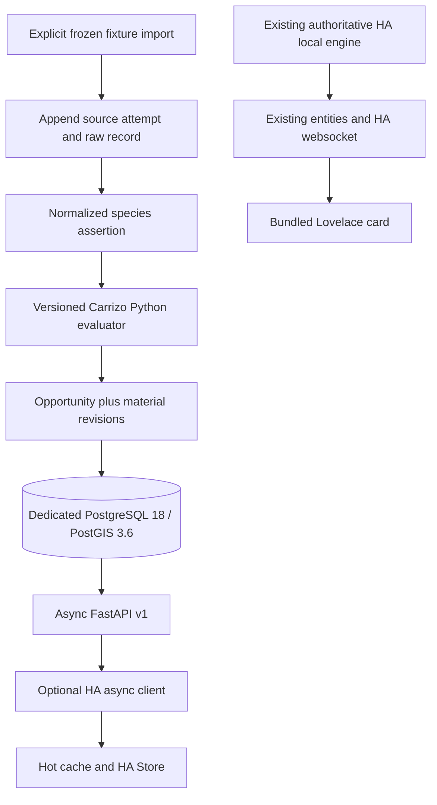

# Photography Events Core — Milestone 1 implementation review

Prepared 2026-10-01. This packet describes implemented code and reproducible
evidence, not a production migration. The original specification is preserved
in [docs/IMPLEMENTATION_SPEC_MILESTONE_1.md](docs/IMPLEMENTATION_SPEC_MILESTONE_1.md).

# 1. EXECUTIVE SUMMARY

Created a standalone Core on the existing empty `main` repository: async REST
v1, independent configuration/authentication, explicit PostGIS/Alembic schema,
raw-to-normalized ingestion, a source-controlled Carrizo Tule Elk evaluator,
material decision revisions, source-health projection, scheduler/backoff and
retention frameworks, Docker deployment and operator backup/restore scripts.
Added an isolated HA async client and persisted developer cache. The production
HA engine, card, version 0.16.1 and release state remain unchanged.

The mandatory Tule Elk slice evaluates synthetic logical inputs through new
Core code and compares them with outputs captured by executing the real pinned
HA engine. It does not hard-code expected opportunity JSON. No production
collectors, Unraid deployment, NAS scheduling, HA cutover or public release was
performed. Condor is explicitly deferred below.

Acceptance evidence is recorded in sections 26–31 and the committed
`docs/validation/` snapshots. Runtime acceptance is green at the recorded Core
and HA implementation SHAs: 71 Core tests with real PostGIS, 15 Tule Elk cases,
575 portable HA tests (90 skipped), 127 card tests, and 90 real-HA tests on each
of two compatibility versions. Actual backup/restore scripts passed in CI.

# 2. REPOSITORIES

| Repository | Original main | Final implementation snapshot |
|---|---|---|
| https://github.com/Tmatz27/photography-events-core | Empty repository; no commit existed | `f3aca3172220107e9308c73e2904511484fdad40` |
| https://github.com/Tmatz27/Home-assistant-photography-events | `4905e35c0668c37737d84685e65d2a806f7c92f7` | `7a9d4c6bcf00ffe17b68190a10df4dc83d4db83c` |

Core commits created:

- `2423a18952ccee9ce2ac4afacb53adf70daaffaa`: foundation and Carrizo parity slice.
- `241ea23d3aeedd721210f2352188ca3736130fa9`: private-network acceptance execution and persistent backoff.
- `3e03aa433108aa506c3fc648cf8269c482eb3ba9`: restore extension ownership with administrator privileges.
- `e4014034c3af05379cb6d8ce34fbc47a777d2d64`: execute actual operator scripts and deployment boundary checks.
- `f3aca3172220107e9308c73e2904511484fdad40`: include Compose and operator scripts in the acceptance test image.
- The subsequent documentation commit contains this packet, original specification
  and validation evidence. A Git commit cannot contain its own hash; the exact
  final main tip including this packet is recorded in the delivered submission
  receipt and final response. Resolve the packet commit with
  `git log -1 --format=%H -- IMPLEMENTATION_REVIEW_MILESTONE_1.md`.

HA commits created:

- `b7671408a44315258cf8468c50ac49343399594e`: async client and HA Store developer bridge.
- `7a9d4c6bcf00ffe17b68190a10df4dc83d4db83c`: retain last complete cache across incomplete responses.

Both repositories were cloned and `git pull --ff-only` was attempted before
edits. HA was current. Core had no remote `main` ref yet, so pull correctly
reported no such ref; its first commit created `main`. All pushes were ordinary
fast-forward pushes, without branches, PRs, tags or releases.

# 3. ARCHITECTURE IMPLEMENTED

The optional client/cache has no production coordinator wiring. The card never
connects to Core. Core production startup does not seed fixture data or schedule
live provider requests. SQLAlchemy is used for bounded async SQL and transactions;
the explicit SQL migration is the database model, not a second ORM schema.

# 4. PROMPT DEVIATIONS

| Requested direction | Implemented behavior | Reason and risk |
|---|---|---|
| Tule Elk port | Calendar plus species-presence path, 15 cases | Mandatory meaningful opportunity is reproduced. Legacy free-text behavior-report parsing is not ported; Core must not be described as full Tule Elk feature parity. |
| Condor preferred | Deferred | Independent count/behavior/encounter paths, NPS access dependency and daily occurrence keys deserve their own fixture contract. Details in section 14. |
| Routed baselines calculated/reused | Table, uniqueness and persistence schema only; legacy calibrated estimate remains in slice | No routing credentials/provider activation supplied. Inventing a routed duration would be wrong. Live routing remains a follow-up. |
| HA Core connection | Explicit developer factory/scaffolding only | Permitted by brief; avoids switching the reviewed production engine. No selectable UI backend yet. |
| Source collectors and backoff framework | Async scheduler plus persistent state methods; no registered jobs | M1 permits framework only and forbids new live source families. Collectors must append attempts through their adapter. |
| Retention machinery | Bounded callable sweeper, not a running periodic task | No production collection load yet. An operator must invoke it when enabling ingestion; no claim of automatic cleanup. |
| No-ID dedup design | No semantic dedup for absent IDs | No active provider without stable IDs. Planned source-specific canonical exact-record fingerprint may detect byte-equivalent repeats within an attempt; it must not establish semantic identity across observations. Current absent-ID rows remain separate. |
| Docker/restore demonstration | Performed on GitHub Actions Linux runner | Local Windows host has neither Docker nor WSL. No claim of actual Unraid/NAS validation. |
| Final SHA inside committed packet | Code SHA here, packet tip in delivered receipt | A commit cannot include its own hash. Runtime tree and documentation tip are distinguished explicitly. |

No unrelated legacy logic was fixed. The old 14-day presence cutoff (distinct
from the seven-day behavior-report cutoff) and the original seasonal dates were
preserved and documented. No unsafe legacy behavior was intentionally introduced
or silently corrected during this port.

# 5. FILE INVENTORY

Core created (no existing Core files were modified or deleted):

| Files | Purpose |
|---|---|
| `.gitignore`, `.gitattributes`, `.dockerignore` | Secrets/artifact exclusions and LF normalization |
| `.env.example`, `compose.yaml`, `compose.ci.yaml`, `Dockerfile` | Production two-service deployment and CI-only test image target |
| `pyproject.toml`, `requirements.lock`, `requirements-dev.lock` | Package metadata and reproducible dependency selections |
| `LICENSE` | Preserve source MIT attribution to Travis Matzdorf |
| `alembic.ini`, `migrations/env.py`, `migrations/versions/0001_foundation.py`, `0001_schema.sql` | Explicit transactional schema/spatial migrations |
| `src/pec/__init__.py`, `__main__.py` | Independent versions and explicit fixture import CLI |
| `src/pec/config.py`, `logging.py` | Redacted settings and structured event vocabulary |
| `src/pec/api.py`, `schemas.py` | Authenticated typed v1 API and sanitized errors |
| `src/pec/database.py` | Bounded async SQL, health projection, product/revision writes, backoff persistence |
| `src/pec/ingestion.py` | Raw record -> stored normalized assertion -> application evaluation |
| `src/pec/phenomena.py`, `definitions/tule_elk_rut.json` | Source-controlled Carrizo rule and metadata |
| `src/pec/legacy_safety.py`, `spatial.py` | Reviewed safety-only and great-circle legacy port |
| `src/pec/scheduler.py`, `retention.py` | Non-overlap/backoff/shutdown and bounded maintenance frameworks |
| `scripts/20-app-user.sh`, `start.py` | Non-superuser DB role initialization and migrate-before-serve |
| `scripts/backup.sh`, `restore.sh` | Custom-format backup and new-database-only restore |
| `tests/test_api.py`, `test_database.py`, `test_parity.py`, `test_scheduler.py`, `test_operations.py` | Automated behavioral, database, deployment and parity contracts |
| `tests/fixtures/legacy_tule_elk.json` | Frozen logical inputs, source hashes and executed legacy expectations |
| `tools/capture_legacy_parity.py`, `database_tests.py`, `acceptance.py` | Independent legacy capture and real container acceptance |
| `.github/workflows/validate.yml` | Portable/static and real Docker/PostGIS/restore CI |
| `README.md`, this packet, `docs/IMPLEMENTATION_SPEC_MILESTONE_1.md`, `docs/SCHEMA_MILESTONE_1.md`, `docs/validation/*` | Operations, original specification, complete DDL and reproducible validation evidence |

HA created `core_client.py`, `core_bridge.py`, `tests/test_core_client.py`,
`tests/test_ha_core_bridge.py`, `tests/fixtures/core-v1.json`, `CORE_DEVELOPMENT.md`.
HA modified `.github/workflows/validate.yml` and `release.yml` only to install
aiohttp for the new isolated portable tests. aiohttp is already supplied by HA
at runtime; no integration runtime requirement was added. The release workflow
was not dispatched. No HA files were deleted and no card/generated assets changed.

# 6. CORE DEPENDENCIES

| Package | Version | Purpose |
|---|---|---|
| Python | 3.12.14 | Runtime |
| FastAPI | 0.142.2 | ASGI routing and typed API |
| Pydantic | 2.13.5 | Public contract validation |
| SQLAlchemy | 2.1.1 | Async connection pool, transactions and parameterized SQL |
| asyncpg | 0.31.0 | Async PostgreSQL driver |
| Alembic | 1.20.0 | Explicit migration ordering |
| Uvicorn | 0.54.0 | ASGI server |
| tzdata | 2026.4 | Portable timezone database |
| pytest / pytest-asyncio | 9.1.1 / 1.4.0 | Core tests |
| HTTPX | 0.28.1 | In-process HTTP contract tests only |
| Ruff | 0.16.9 | Single Core lint tool |
| PyYAML | 6.0.3 | Deployment contract tests only |

Lockfiles include all installed transitive versions. No GeoAlchemy is needed
because geometry operations use explicit SQL. Standard asyncio handles scheduling;
no APScheduler, Redis or broker was added. Container tags are versioned but not
digest-locked; a future image rebuild may contain upstream image patch changes.

# 7. DOCKER DESIGN

Two production services. DB: `postgis/postgis:18-3.6`, internal `database` network,
no host port, bind mount at `/var/lib/postgresql`, initialization script, pg_isready
health every 5 seconds, three-second timeout, 12 retries, 20-second start period.
Core: Python 3.12.14 slim runtime target, UID 10001, internal database plus separate
`api` bridge network, one configurable LAN API binding, appdata mount, readiness
health every 10 seconds, five-second timeout, six retries, 30-second start period.
Both use `unless-stopped`; Core waits for initial DB health and has a 20-second
shutdown grace period. Core can remain live while a running DB is unavailable.
The CI override chooses the test build target without publishing a DB port or
adding infrastructure services. The isolated restore container is temporary test
infrastructure using the same Core image, not part of production Compose.

# 8. UNRAID DEPLOYMENT

Exact production defaults and startup steps are in README: clone under
`/mnt/cache/appdata/photography-events-core/repo`; database storage
`/mnt/cache/appdata/photography-events-db/`; Core appdata
`/mnt/cache/appdata/photography-events-core/`. Copy `.env.example` to `.env`, generate
separate `POSTGRES_ADMIN_PASSWORD`, `POSTGRES_PASSWORD`, `CORE_API_TOKEN`, choose
`CORE_BIND_IP`, `CORE_PORT`, `CORE_DATABASE_TIMEOUT`, `DB_DATA_PATH`, `CORE_DATA_PATH`,
and set the actual mounted `BACKUP_DIR`. Run `docker compose config -q` and
`docker compose up -d --build --wait`. Verify both health endpoints. No `/mnt/user`
recommendation, public exposure, router change or GPU device mapping is included.

# 9. DATABASE SCHEMA

Authoritative definitions are in
[`0001_schema.sql`](migrations/versions/0001_schema.sql). The full DDL is reproduced
in [docs/SCHEMA_MILESTONE_1.md](docs/SCHEMA_MILESTONE_1.md), including every column,
type, primary/foreign key, unique/check constraint and index.

Tables: `sources`, `source_roles`, `source_runs`, `source_backoff`,
`raw_observations`, `normalized_observations`, `locations`, `phenomenon_locations`,
`route_baselines`, `assessment_runs`, `opportunities`, `opportunity_revisions`,
`opportunity_observation_evidence`, `opportunity_context_evidence`. Alembic owns
`alembic_version`. The only application view is `source_health_current`.

BIGINT identity row IDs are distinct from textual product keys. Observation
external IDs are unique per source, with NULLs allowed. Normalized raw ID is not
unique; `(raw_observation_id,subject_type,subject_key)` identifies an assertion.
Roles/dispositions/states use checks; all evidence associations have real FKs.
Location geometry is generic Geometry, allowing Point/Polygon/MultiPolygon later.
`product` JSONB is a validated public DTO, not raw provider data or executable
policy; decision columns remain independently queryable. Revisions contain typed
decision columns, not entire public products every poll.

# 10. POSTGIS

Requested image is PostgreSQL 18 / PostGIS 3.6. The acceptance JSON records exact
server and extension build versions. Canonical SRID is EPSG:4326. Raw and
normalized geometries are Point; location geometry is generic Geometry. There
is one GiST index on normalized analysis geometry, for local evidence lookup.
Used functions: `ST_SetSRID`, `ST_MakePoint`, `ST_X`, `ST_Y`; tests also exercise
`ST_GeomFromText`, `ST_SRID`, `ST_DWithin(...::geography, ...::geography, metres)`.
The preserved legacy drive estimate uses a spherical great-circle calculation,
not a degrees-to-miles approximation. No DBSCAN or metric clustering exists.
The image also supplies extensions such as `postgis_topology`; restore handles
them with administrator privileges rather than granting Core superuser access.

# 11. MIGRATIONS

One revision: `0001`. It explicitly runs `CREATE EXTENSION IF NOT EXISTS postgis`
and all typed tables/checks/FKs/indexes/view. Extension creation requires a DBA
unless already initialized by the image; the normal app role is not superuser.
No spatial autogenerate was used. Upgrade runs before Uvicorn and is repeat-safe
through Alembic's revision tracking. CI tests empty-DB upgrade, a repeated
upgrade, then downgrade/base and upgrade/head on a separate disposable `_test`
database. Downgrade leaves the shared extension installed deliberately.

# 12. PHENOMENON DEFINITIONS

Definition key `tule_elk_rut`, version `legacy-0.16.1-1`. Inspectable JSON stores
curated description, dates, location, gear and legacy policy metadata; executable
Python supplies evidence/gate/identity behavior. SHA-256 includes definition JSON,
`phenomena.py`, `legacy_safety.py` and `spatial.py`, with normalized LF bytes and
filenames. Each product and revision records key/version/hash/engine version.
No executable rules are stored in PostgreSQL JSONB.

# 13. TULE ELK PORT

Source is the pinned HA 0.16.1 implementation, not a newly invented phenomenon:

| Legacy implementation | Core equivalent |
|---|---|
| `phenomena.WINDOWS_BY_KEY['tule_elk_rut']` | Carrizo source-controlled definition; Sep 15–Oct 10, same curated coordinates/site |
| `active_windows` plus `event_state.event_id` | Original-window-start textual occurrence key; recalculation does not replace it |
| `events.corroborating_sightings/window_evidence` | Species prefix, 120 km, 14-day presence cutoff; fetch time is not observation time |
| `build_seasonal_opportunities/_score_from_evidence` | 60-day precision boundary, calendar/calendar_presence/season classification and awaiting strings |
| `eligibility.assess/dashboard` | Separate significance/confidence/urgency, seven-day/drive/safety gates and Watching membership |
| `weather_hazards.safety` | Reviewed source-only safety extraction; no collectors or watch-signal features |
| `gear.recommend` | The exact selected owned-kit recommendation as source-controlled metadata |

The primary location remains Carrizo Plain, Soda Lake Road foothills. The legacy
definition contains a Point Reyes reference and alternative location; no new
Point Reyes Core phenomenon was created. Preserve the existing rule provenance
and review its scientific justification separately. Structured behavior report
parsing is not part of this narrow port.

# 14. CONDOR PORT

Deferred, not claimed as passing. Inspected `birds.classify` and `_spectacle_row`,
`curation.CATALOG['condor_activity']`, `eligibility._bird_views`, and the existing
`TestBirds` cases. Condor differs from the mandatory slice: one fresh threshold
count or admissible behavior report can create a spectacle; independent reports
over multiple days create an encounter; site selection must expose a curated
public viewpoint; counts retain their own evidence timestamp; NPS access and
gear/ethics differ. `_spectacle_row` keys currently include the evaluation date.
Porting one count fixture while claiming full Condor parity would omit the
encounter, stale-count, report and occurrence-state behaviors. This was deferred
to keep M1 bounded. No generalized clustering was added to make it fit.

# 15. PARITY HARNESS

`tools/capture_legacy_parity.py` independently loads only the legacy package,
asserts its exact base SHA and records SHA-256 hashes of eight source files.
Fixtures are synthetic inputs plus outcomes produced by that code. It never
imports Core or reads Core expectations. Frozen expected JSON is not used by
Core evaluation; the application reads its rule definition and logical inputs.
The normalized comparison maps legacy `watch` to `watching`, converts equivalent
UTC timestamp spellings, and compares explicit product semantics. No allowed
numeric tolerance or ignored decision difference exists in these cases.

# 16. PARITY RESULTS

15/15 cases pass, plus one stable-identity recalculation test. Compared 24 fields:
phenomenon_key, occurrence_key, starts_at, ends_at, eligibility, presentation,
significance, confidence, urgency, drive_minutes, drive_basis, safety_state,
access_state, evidence_state, reason, awaiting, blockers, held, cant_miss,
watching, gear, ethics, safety_summary, safety_notes.

Cases: no report, recent presence, stale presence, day-10 presence, distant
presence, wrong species, unknown safety, drive cap, unsafe weather, next year,
approaching window, beyond-week window, season precision, after-season empty,
end of window. There is no bird-classification assertion because Condor is
deferred. This is verified vertical-slice parity, not full-engine parity.

# 17. CORE API

| Endpoint | Input | Success contract |
|---|---|---|
| `GET /health/live` | None; unauthenticated | Version metadata plus alive |
| `GET /health/ready` | None; unauthenticated | Version metadata plus ready, or 503 |
| `GET /api/v1/opportunities` | Optional presentation and category enum filters | OpportunityList envelope |
| `GET /api/v1/opportunities/{occurrence_key}` | Deterministic textual key | Opportunity or 404 |
| `GET /api/v1/sources/health` | None | Versioned source-health list |

Data routes require bearer authentication. List envelope: generated_at,
data_as_of, assessment_state, missing_required_sources, degraded_sources, items,
and software/API/schema versions. Opportunity schemas explicitly include public
location, window, presentation/eligibility, distinct scores, evidence/access/
safety/conditions, drive basis, explanations, held/Watching, gear/advice,
data_as_of/valid_until and rule provenance. See `schemas.py` and generated
OpenAPI for exact types and enums. Unknown request filters are 422, auth failures
401, missing occurrence 404, DB/schema unavailable 503. Errors are sanitized
`error.code/message`. No raw ORM or provider record is serialized.

# 18. HEALTH / READINESS

Liveness performs no DB/provider access. Readiness checks the actual connection,
Alembic revision `0001`, installed PostGIS 3.6 and application relations. Provider
staleness changes assessment quality rather than process readiness. A migrated
empty DB is ready to serve an explicitly incomplete assessment. Every data route
checks readiness and propagates database failures as 503. A repeatable-read
transaction keeps opportunity membership and the assessment header consistent.

# 19. AUTHENTICATION

Environment token, length/placeholder validation, constant-time byte comparison.
No auth dependency on the DB. Admin DB secret is passed only to the DB service;
Core receives the application-role password. Normal API errors and structured
events omit exception strings, DSNs, request bodies and headers. HA developer
factory reads Core URL/token from private ConfigEntry data; response objects,
Store payloads and card-facing data contain no token. Redirects are disabled.
LAN HTTP is supported; transport encryption can be supplied separately if needed.

# 20. HA INTEGRATION CHANGES

Only the isolated client/cache modules, fixtures/tests, developer document and
test dependency installation changed. No config flow, coordinator, sensor,
calendar, websocket, card, release version or runtime manifest requirement was
changed. Core is not constructed by default. Activation is an explicit developer
test call to `async_create_developer_bridge(hass, entry)`. The existing local
engine and integration/card suites remain valid. Full details are in the HA
repository's `CORE_DEVELOPMENT.md` at the recorded SHA.

# 21. ASYNC SAFETY

All Core HTTP is concentrated in one aiohttp client using HA's shared session,
`ClientTimeout` plus `asyncio.timeout`, bounded body reading and disabled
redirects. No requests library, sync socket or synchronous Core HTTP was added
to HA. One refresh performs readiness then opportunities (each bounded to five
seconds); other HA tasks continue running. An async heartbeat test completes
while a simulated hung Core request times out. HA Store uses its async API.
Operator/CI scripts may use blocking HTTP because they are not in HA's loop.

# 22. CACHE / OFFLINE BEHAVIOR

Validated complete API products are kept in memory and persisted with saved_at
using version-1 HA Store keyed by entry and a hash of the Core origin. A current
incomplete response is returned honestly but does not erase the last complete
cache. Restart loads validated saved data. On timeout/auth/version/readiness/
network/protocol failure, cached data up to seven days old is explicitly STALE
and incomplete; rows become held, ineligible, safety unknown. Older/no cache
returns empty items with an unavailable assessment message. No provider payload
is cached and no offline path emits the quiet-week headline. Future per-tab TTL
policy and production card projection remain deferred.

# 23. SOURCE HEALTH

`source_health_current` joins sources to the latest attempt and latest success
without replacing historical failures. Application code derives UP/STALE/DOWN
using enabled/status and provider_updated_at (falling back to success time only
for freshness of collection, not animal evidence). M1 source TTLs: NWS three
hours, fixture observations 24 hours. Both are required for a complete assessment
of this installed slice. No source rows/no assessment is incomplete, never a
quiet week. Individual opportunity validity is also enforced at read time.

# 24. RATE-LIMIT FRAMEWORK

Policy contains minimum interval, timeout and maximum backoff. Failure increments
consecutive failures and applies exponential delay with bounded jitter;
Retry-After accepts seconds or HTTP date. Successful work resets failures.
Duplicate source registration is rejected and only one job per source runs.
Cancellation propagates; shutdown cancels and joins all tasks. `Database`
load/save methods persist next_allowed_at/failure count in `source_backoff`, and
a new-client test reads the same state. Collector-specific adapters and live
source-run recording are future work, not fifteen placeholder collectors.

# 25. RETENTION

Callable `sweep(connection, now, batch_size)` enforces batches of 1–5000. It
redacts raw_payload after 90 days using observation time where known, and deletes
only unreferenced old source runs. Evidence IDs, normalized assertions, spatial
provenance and opportunity revisions remain. It is not automatically scheduled
and is not a complete long-term storage policy. Later source-specific durations,
geometry retention and measurements are required before broad live ingestion.
No per-row raw expiry, partitioning or bulk imagery archive was added.

# 26. BACKUP

Exact operator command: `BACKUP_DIR=<mounted-NAS-path> sh scripts/backup.sh`.
Underlying command: `docker compose exec -T photography-events-db pg_dump -U
postgres -d photography_events -Fc --no-acl`, writing a private `.partial` file
then renaming only on success. The custom-format archive preserves object owners.
The acceptance runner checked the `PGDMP` signature. The actual operator script
produced a **56,846-byte** custom-format archive in the successful
[Core acceptance run](https://github.com/Tmatz27/photography-events-core/actions/runs/36916376613).
The archive itself was intentionally not uploaded. The committed
[acceptance JSON](docs/validation/core-acceptance.json) records its size and result.
No nightly schedule or production NAS connection was installed.

# 27. RESTORE

Exact operator command: `sh scripts/restore.sh <backup.dump>
photography_events_restore_test`. It refuses reserved/production/unsafe names;
createdb refuses an existing destination. A clean database is created with the
application role as owner, required PostGIS state is prepared, administrator
pg_restore restores extension objects and original application ownership, then
the application role runs migrations. CI starts a fresh Core on restored DB,
checks readiness and reads `tule_elk_rut-2026-09-15`. **Passed** using the actual
operator scripts on Core SHA `f3aca3172220107e9308c73e2904511484fdad40`, with
PostgreSQL **18.6** / PostGIS **3.6.4**. Application table ownership was explicitly
verified as `photography_events` after restore. See the acceptance JSON and CI run.

An earlier test restore exposed that the image contains postgis_topology and
cannot be fully restored using the non-superuser app role. The fixed operator
script performs restore as administrator and preserves app table ownership;
Core remains non-superuser. The earlier failure is not reported as a pass.

# 28. TESTS

Baseline HA: `python -m unittest discover -s tests -q`: 561 run, 472 passed,
89 skipped (HA absent). `node --test tests/photography-events-card.test.mjs`:
127 passed, zero failed/skipped. The first baseline attempt lacked bs4; after
installing the existing dependency in an isolated venv the unchanged baseline
passed. No legacy fix was made to accommodate that environment error.

Final local HA: same unittest command, **575 run, 485 passed, 90 skipped**, zero
failures/errors. New client/bridge tests alone: 13 passed. Card source unchanged;
the existing CI reruns the 127 card tests. Real HA contracts command:
`python -m unittest discover -s tests -p 'test_ha_*.py' -v`, with Python 3.12 /
HA 2024.11.3 and Python 3.13 / HA 2025.3.4. Both matrices passed **90/90**, no
failures/skips, on final HA SHA `7a9d4c6bcf00ffe17b68190a10df4dc83d4db83c`.
[Final HA CI](https://github.com/Tmatz27/Home-assistant-photography-events/actions/runs/36915089698)
also passed HACS, all 127 card tests and 575 portable Python tests (90 skipped).
See [machine-readable counts](docs/validation/ha-ci.json).

Core local: `python -m pytest -q`: **49 passed, 22 skipped**, zero failures.
Skips are 18 real PostGIS tests plus four Linux operator-script cases. Full
Linux/container command: `python tools/acceptance.py`; it invokes pytest inside
the private network with a disposable `_test` database. The successful CI run
completed **71 passed, zero failures/skips**, including all 18 database and four
Linux script-guard cases. Host portable tests were **53 passed, 18 skipped**.
The full container command is `python tools/database_tests.py` (sets the isolated
test DSN in-process, then invokes pytest with JUnit output). The committed
[pytest output](docs/validation/core-pytest.log) and
[JUnit test inventory](docs/validation/core-tests.xml) record all results.
[Core CI](https://github.com/Tmatz27/photography-events-core/actions/runs/36916376613)
passed every job step at `f3aca3172220107e9308c73e2904511484fdad40`.

# 29. STATIC / LINT / BUILD VALIDATION

Core: `python -m compileall -q src migrations tools`; `python -m ruff check src
migrations tools tests`; `python -m alembic upgrade head --sql`; generated
`create_app().openapi()`; YAML parsing and real `docker compose config -q`.
All observed static checks pass. SQL is explicit; no metadata-autogenerate
consistency claim is made. Typed contracts use Pydantic; no additional static
type checker was adopted. Runtime and dev lockfiles were installed successfully
in CI and the container image.

HA: `node scripts/build-card.mjs --check`, `node --check
custom_components/photography_events/www/photography-events-card.js`,
`node scripts/check-version.mjs`, and pyflakes over all integration/tool `.py`
files. All pass. On Windows the shell does not expand wildcards for Python;
filenames were expanded with PowerShell before invoking pyflakes. No formatting
changes were made to old Python/card files.

# 30. DOCKER VALIDATION

CI runs against the two-service Compose design and a test image stage with the
same runtime code. The production runtime stage is built as its parent and uses
no test dependencies. Startup, extension, migration, readiness, auth, persistence,
Core restart, DB stop/restart and restore results are in the evidence JSON.
**All passed** on the Linux CI runner. Observed versions were PostgreSQL 18.6,
PostGIS 3.6.4, Core 0.1.0-dev, API v1, schema 0001. Both repeat-upgrade and
disposable-database downgrade/upgrade passed. DB stop returned live 200, ready
503 and data 503; restart restored readiness and retained the same occurrence.
The fresh restored Core also passed readiness and occurrence read. No local
Docker/WSL or actual Unraid claim is made.

# 31. FAILURE INJECTION

| Scenario | Verification |
|---|---|
| DB stopped | Real liveness 200, readiness 503, data 503 |
| DB restarted | Readiness recovers and stable occurrence remains readable |
| Core restarted | Persisted occurrence survives and readiness passes |
| Missing/wrong bearer | 401 with safe error and WWW-Authenticate |
| Core unreachable/timeout | HA typed failure; async heartbeat keeps running |
| Unsupported API version | HA CoreVersionError and stale/incomplete fallback |
| HA restart offline | Real Store preserves last complete product, marks held/ineligible |
| Provider/incomplete assessment | Empty incomplete is not complete-empty; cache is not erased |

Core first CI failed at an attempted host connection to an internal-network DB;
tests now run inside that network without any DB host port. The second CI reached
backup but failed on extension privileges during restore; owner-preserving admin
restore fixed that. The next run exposed five test-image packaging failures:
new operator tests could not find Compose/scripts inside the test image, while
the existing 66 tests passed. Adding those files to the test stage produced
the final 71/71 green run. These intermediate failures were investigated and
fixed; none is reported as an acceptance pass.

# 32. SECURITY REVIEW

No DB host port in production or CI; Core default loopback binding and explicit
LAN configuration. No public tunnel/listener configuration, router change, OAuth
or user account system. No committed `.env` or real credential. Test tokens are
synthetic literals; CI secrets are generated at runtime and not printed. Backup
files are excluded from Git/artifact upload; only test summaries are uploaded.
App DB role is non-superuser. Restore requires admin privileges and existing
expected roles. Migration API errors and logs are sanitized. Sensitive normalized
locations are withheld and the public DTO uses the curated site only. LAN bearer
transport is HTTP unless the operator supplies HTTPS; this is not an Internet
service. Broad ingestion and multi-user authorization are not implemented.

# 33. PERFORMANCE REVIEW

Expected load is one HA consumer and a tiny curated product set. SQLAlchemy pool
size 5, overflow 0, bounded checkout/driver/statement/whole-operation deadlines,
and pre-ping for restart recovery. Async SQL/HTTP avoids HA event-loop blocking.
Indexes support latest source runs, retention time, observation validity/subject,
spatial evidence, active presentation/end time, occurrence uniqueness and FK
joins. A repeatable-read list fetch and a transaction-scoped advisory lock on
product writes protect snapshot consistency/single-writer updates. No pagination
is implemented for the one-slice API; must be added before broadening the catalogue.
No load-test or production-latency claim is made.

# 34. KNOWN LIMITATIONS

One phenomenon path, synthetic ingestion only, no parsed behavior-report port,
no Condor, no live route collection, no production Core connection flow/card
cutover, no automatic retention scheduling, no pagination, no multi-replica
scheduler ownership, no NAS/Unraid field trial. Exact sensitive raw coordinates
are retained as provenance even after payload redaction; future source-specific
retention must address that. API “complete” covers only the installed slice.
Legacy calibration and seasonal policy were preserved, not scientifically
revalidated. Source-run and assessment history growth needs production policy
before live collection. Container image tags are not digest-pinned.

# 35. DEFERRED FEATURES

No generalized DBSCAN/clusters, Map/raw feed UI, BirdCast, USGS OGC, CDEC, NWPS,
CalHABMAP, CoastWatch, Sentinel-2, GOES, HPWREN, MBARI, new phenomena, iGPU/OpenVINO,
ML, Redis, Celery, Kafka, RabbitMQ, Elasticsearch, TimescaleDB or partitioning.
No `/dev/dri` mapping. No Cloudflare/public API. No v0.17 release, tag, HACS update
or GitHub Release. The card remains bundled with HA.

# 36. TECHNICAL DEBT CREATED

Safety subset copied with source provenance needs deliberate synchronization when
legacy hazard policy changes. Typed query columns plus validated public product
JSON duplicate some fields; one repository write method owns consistency, but
future direct SQL writers must not bypass it. Fixture adapter is intentionally
not a provider SDK. Scheduler source-run adapter integration, per-content cache
TTL, per-source retention, source-ID-free fingerprinting and route acquisition
remain explicit follow-ups. The original self-contained schema DDL avoids ORM
autogenerate complexity but requires deliberate future migration review.

# 37. QUESTIONS FOR INDEPENDENT REVIEWER

1. Reproduce all 15 semantic cases from the pinned legacy SHA, not just frozen expectations.
2. Challenge the preserved 14-day presence versus seven-day behavior freshness and seasonal-source justification.
3. Attempt stale/repeated/changed-external-ID inputs; confirm fetch time never extends evidence.
4. Check public geometry across persisted products, errors and HA Store, including sensitive assertions.
5. Test corrupt/mismatched schema, prolonged DB loss, cancellation and pool recovery.
6. Attack complete-empty versus incomplete semantics and incomplete-response cache retention.
7. Verify material revision selection and evidence provenance across multiple recalculations.
8. Independently run operator backup/restore against this exact PostGIS image and verify object ownership.
9. Examine Condor's daily identity before deciding what stable occurrence means across observation days.
10. Assess whether the documented narrow slice and deferred wiring satisfy the desired next phase before enabling any production backend.

# 38. NEXT MILESTONE RECOMMENDATION

After independent review, first close any integrity/operational findings. Then
extend explicit parity to dated Tule Elk behavior evidence and the complete
Pinnacles Condor count/encounter/access/public-site paths, deciding daily episode
identity deliberately. Add one existing-provider adapter with persistent attempts
and backoff, live route baselines, measured retention, and richer contract tests.
Only then design an opt-in HA connection flow and websocket/card projection with
content-specific stale policy. Keep the local engine as the comparison oracle
until a deliberate cutover milestone. None of that follow-up was implemented here.
