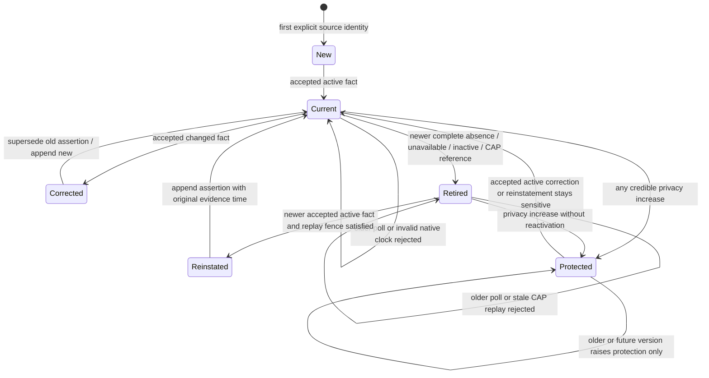

# Milestone 3A implementation review

Sections 1–31 retain the original implementation receipts. The independent
review correction in section 32 supersedes their implementation freeze, schema
head and readiness statements; it does not erase the historical 364-test baseline.

## 1. Executive summary

First public source slice: iNaturalist bear/monarch observations, NIFC current
WFIGS perimeters, and formal NWS alert/forecast contracts. All writes and
interpretations remain shadow-only. No production promotion, release, new
notification, map, vision or deferred provider. M1 behavior remains locked;
M2 changes are the required L1 isolation and narrow live-identity/admission and
calibration extensions. HA is unchanged.

## 2. Starting and final SHAs

Verified clean `main` and actual `origin/main` before edits:

- Core start: `c64159688202dfb57594e74006dbf2e9ebd9d6c7`.
- HA start/final: `c76726ece1e485ece03810087927da344289fba7`; unchanged, clean,
  equal to origin/main on final verification.
- Core code freeze: `b6a7547995f483f6b97df487f28bf9f93fa5daa9`.
- Final submission is a documentation/evidence-only descendant of that freeze.
  The exact submission SHA, clean origin/main check and final-tip CI receipt
  are recorded in the external `outputs/M3A_FINAL_RECEIPT.md` beside this checkout
  and in the final response. This avoids a self-referential commit SHA in a
  committed file. Treat the freeze as the final implementation SHA.

Freeze CI: [Core validation](https://github.com/Tmatz27/photography-events-core/actions/runs/37797766918).
Its downloaded artifact and exact results are archived under `docs/evidence/m3a`.

## 3. M3 Source Contract design

`src/pec/sources/contracts.py` contains immutable typed dataclasses with version,
canonical hash, identity, roles, authentication, rate/polling/pagination,
correction/deletion, native timestamps, precision, privacy, quality, count,
behavior, malformed-record, freshness, retention and CAN/CANNOT_PROVE fields.
No executable policy lives in DB JSONB. JSONB holds provider facts and sanitized
operational context only. Fact, Core interpretation and phenomenon policy have
different provenance labels. Typed authenticated DTOs project explicit fields.

Migration **0007** is append-only and source-neutral. It adds actual DATE
precision, native update times, public provider geometry distinct from legacy
exact geometry, area assertions, operational counters and one generic polling
state table. Migrations 0001–0006 are unchanged. It retains the forward-only
backup/restore approach. There is no per-provider observation table or partition.

## 4. L1 malformed-row correction

Stored `external_id: null`/empty uses the existing raw ID or deterministic
`legacy-raw-{id}` fallback. Working-set parsing isolates each identity/metadata
failure, emits fixed `identity_invalid` codes, excludes that assertion from the
affected analysis and increments the published run's `identity_rejected_count`.
Valid siblings and exact dependency closure continue. No fuzzy identity.
Eleven portable cases and a real-DB mixed-validity publication case cover this.

## 5. iNaturalist official API contract

Public [v1 observations](https://api.inaturalist.org/v1/docs/), not scraping or
authenticated private coordinates. The actual official
[Swagger source](https://raw.githubusercontent.com/inaturalist/iNaturalistAPI/main/lib/views/swagger_v1.yml.ejs)
defines `updated_since`, `id_above`, ID list filtering, ascending `order_by=id`
and `per_page` up to 200. The bounded live ID-list verification succeeded.
Taxon endpoint inspection verified 41638 = Ursus americanus and 48662 = Danaus
plexippus. The initial central-coast rectangle is (-121.3,34.2,-119.0,36.2),
with a trailing 14-day biological search; no California bulk collection.

## 6. iNaturalist identity

The sampled chosen observation endpoint consistently included UUID; UUID is
canonical external identity. Numeric ID is retained for rotating bulk refresh.
The trusted M2 namespace is the literal adapter `inaturalist`, not arbitrary
provider claims. Synthetic adapters still cannot claim a live origin namespace.
Each UUID is one report; this does not establish different human observers.

## 7. iNaturalist timestamp semantics

Full aware `time_observed_at` becomes UTC evidence time. DATE-only `observed_on`
gets `observed_date`, original timezone if supplied and `time_precision=date`;
`observed_at` and precise analysis point stay NULL. The conservative expiry
envelope is not represented as an observation instant. Native `updated_at` and
`fetched_at` remain separate. Fetch repeats never extend evidence validity.

## 8. iNaturalist geoprivacy

Privacy uses the union of geoprivacy, taxon privacy and actual obscured flags,
including the public v1 `obscured` field observed in samples. The official
[sensitive-location explanation](https://help.inaturalist.org/en/support/solutions/articles/151000233080-how-does-inaturalist-protect-the-locations-of-sensitive-species-)
describes randomized obscured public coordinates. Such geometry is raw provider
geometry with `obscured_cell` basis, never a precise DBSCAN point or destination.
Private geometry is discarded. Open unknown accuracy/DATE-only remains excluded
from tight density. Historical protection rises on privacy corrections and
unreadable known corrected records; old debug clusters redact immediately.
No automatic reduction of already raised protection.

## 9. iNaturalist count semantics

Normalized `reported_count` is NULL. Ordinary observation totals and free text
never become individual animal totals. Multiple records are report counts,
explicitly distinct from animal counts. No SUM count path was introduced.

## 10. iNaturalist behavior boundaries

Presence only. Controlled annotation IDs/values are retained without invented
behavior mappings. Descriptions are retained as raw source text and never parsed
by feeding/cub/fishing regex. M2 canonical live behavior is `presence`; no live
record establishes provider-confirmed sow/cubs, feeding or foraging.

## 11. WFIGS contract

Official [current WFIGS FeatureServer layer](https://services3.arcgis.com/T4QMspbfLg3qTGWY/arcgis/rest/services/WFIGS_Interagency_Perimeters_Current/FeatureServer/0?f=pjson).
Schema inspection verified Polygon/EPSG:4326, GlobalID, IRWIN identity, native
time/status/category fields, pagination support and 2,000 maximum records.
An object-ID snapshot within the source-controlled rectangle is fetched in
bounded GeoJSON batches; returned IDs, transfer limits (including the GeoJSON
properties envelope) and an after-fetch edit watermark establish completeness.
Incident IRWIN identity wins; GlobalID is the fallback. OBJECTID is transport
metadata only. Valid incident pieces union into one current canonical fact.
Invalid topology is rejected per record; no speculative ST_MakeValid repair.

## 12. Wildfire versus prescribed/historic handling

WF and RX are distinct. Only active WF, Approved/Public/visible/not-deleted,
non-final, no fire-out facts qualify as current fire context. Unknown required
enums reject conservatively. Final, inactive and prescribed facts do not cause
the wildfire hold. A complete valid current snapshot retires absent facts;
partial/error snapshots never prove absence. The actual live example was WF
and `Wildfire Daily Fire Perimeter`; RX/final adversarial fixture variants are
synthetic because the current view is filtered and no such live sample was
captured. Field domains in this layer were not enumerable.

## 13. NWS contract

The existing HA `coordinator.py` active California alert retrieval, strict
`weather_hazards.py` evaluator, retries and M1 pinned safety port remain unchanged.
Core formalizes public weather facts under `nws_live_context`, separate from
locked fixture `nws_alerts`, and adds shadow context for the existing approved
Pismo point. [Official NWS documentation](https://www.weather.gov/documentation/services-web-api)
requires descriptive User-Agent; no paid key and no publicly fixed request rate.
[Official OpenAPI](https://api.weather.gov/openapi.json) does **not** allow `limit`
on `/alerts/active`; the live bounded verification caught this and the request
was corrected. CAP IDs/references model updates/cancellation. Forecast issue
time and valid period stay separate; old native data stays stale after HTTP 200.
Native model reissues with identical weather values retain the new issue time
without extending period validity. General live source health and contract
diagnostics use the same native freshness policy. M1's required source set and
fixture health behavior are unchanged.
Core's new fact parser does not replace HA's production alert decisions.

## 14. Proof boundaries

iNaturalist can report presence, provider taxonomy/quality and public spatial
and temporal basis. It cannot prove behavior, individual totals, different
observers, hidden locations, major grove count or travel eligibility.
WFIGS can support an exact approved-destination intersection hold candidate;
it cannot prove road closures or safe travel from no intersection.
NWS can supply published weather/alerts; it cannot prove wildlife behavior,
actual grove microclimate or monarch aggregation. Debug interpretations never
serialize these Core conclusions as provider statements.

## 15. Source roles

iNaturalist: DISCOVERY, WATCH_SIGNAL, CORROBORATION. Research Grade contributes
stronger corroboration; Needs ID/casual is excluded from tight M2 density.
WFIGS: SAFETY/CONDITION, never ACCESS. NWS: CONDITION/SAFETY.
No live source establishes a production qualification or replaces M1 inputs.

## 16. Polling and rate limits

The existing one-process scheduler handles all three collectors. Public HTTP
runs outside DB transactions and M1 publication locks. Persistent quota/spacing
reservations use the isolated shadow pool, as do source writes. iNaturalist
operates at least 1.05 seconds between requests, <=10,000/day, per-page 200,
30-minute polls, following its
[recommended practices](https://www.inaturalist.org/pages/api+recommended+practices).
WFIGS/NWS poll every 15 minutes, at the same conservative spacing and a product
budget of 2,000/day each; those budgets are not provider-limit claims.
Existing persisted exponential backoff and Retry-After are retained. HTTP
redirects, credentials in URLs and pagination to another host are rejected.
Automatic collection requires explicit `CORE_LIVE_SOURCES=true` AND shadow mode;
defaults remain false/off. No standard CI Internet-provider traffic.

## 17. Correction and update handling

Raw identity upserts, native-update/fetch ordering, content hashes, assertion
supersession and current report memberships preserve corrections. Repeated
UUIDs create no new assertion and do not renew evidence. Taxon/time/geometry,
quality and privacy corrections are tested. Bulk known-ID refresh detects scope
escapes. Missing fully read known IDs become public-unavailable, not proven
deletion. CAP explicit update/cancel references retire older facts. WFIGS
incident correction changes geometry rather than adding an independent fire.

## 18. Malformed-record isolation

Each provider row parses independently; bad identity/time/geometry/privacy,
unknown required taxonomy/enums/count-looking values and schema drift get fixed
codes. Good siblings persist even when pagination becomes incomplete. Each DB
fact writes in a savepoint; malformed polygon topology does not abort siblings.
Any unreadable/incomplete safety result yields unknown freshness, never a safe
empty result. Cancellation propagates while recording a failed attempt; quotas
survive restart. Logs never contain payloads, coordinates, PII or credentials.

## 19. Shadow integration

M1 committed publication remains independent. Live ingestion does not use its
advisory lock or pool. M2 captures trusted live identity and full source-run
provenance in its accepted post-commit lifecycle. Date-only, obscured, private
and unknown-accuracy inputs cannot enter precise clustering. Lower-quality
live records cannot density-confirm. Live clusters are always capped at
developing, even under a fixture policy. Calibration uses new policy hashes
without rewriting DBSCAN, coherence, episodes, MAX count or continuation.
See `docs/LIVE_SHADOW_OPERATIONS.md` for the generation lifecycle: the next new
M1 assessment causes recomputation; polling does not overwrite a published run.

## 20. Black Bear shadow policy

One credible presence -> Signal; multiple nearby independent UUID reports in
the provisional M2 window -> developing activity Watch. Product thresholds are
explicitly `PRODUCT POLICY UNDER CALIBRATION; NOT ECOLOGICAL FACT`. No bear count,
confirmed cubs/feeding/foraging or live production opportunity. Protected/coarse
records may supply generic presence; they never supply tight density/site
assignment. No bear destination is automatically approved.

## 21. Monarch shadow policy

One record -> ordinary Signal; multiple credible precise reports associated
with the approved public Pismo grove -> developing Watch. The existing M2
provisional four-report/200m density settings are retained; the 500m association
is a provisional product radius, not a surveyed habitat boundary or fire buffer.
The curated point comes from HA c76726e conditions.py and
[the public park listing](https://www.parks.ca.gov/?page_id=30273).
Restricted/mismatched existing registry entries suppress destination output.
No date gate was added: September/October arrival evidence can participate.
No private/random observation point or centroid becomes a destination.

## 22. Why temperature does not prove aggregation

NWS temperature modifies photographic context only. Cool forecast conditions
may favor resting/clustered photography; warmer conditions may favor flying/
basking. Neither creates or removes the underlying presence/aggregation signal.
The inherited approximate 55F heuristic is not a universal Can't Miss threshold
or ecological proof. Grid forecast is not measured tree-grove microclimate.
WFIGS exact destination intersection yields a separate shadow hold candidate,
without route closures or a universal nearby-fire buffer.

## 23. Missing authoritative monarch count source

Production monarch qualification needs a verified dated grove/count source.
Candidate: Western Monarch Count/Xerces or another authoritative dated count.
Research machine access and terms separately. No invented API or scraping;
iNaturalist-only results remain Watch/developing, never major aggregation
confirmed. This remains an explicit promotion blocker.

## 24. Actual live measurements

Manual smoke checks, 2026-10-08 UTC: iNaturalist 2 requests / 2 records / 93,609
bytes; WFIGS 2 / 1 / 55,751 bytes; NWS 3 / 3 sampled facts / 172,098 bytes. All
passed. Two extra taxon-ID reads and the initial fixture construction probe
verified identities/schema without private-coordinate access.

Bounded actual initial-scope polls (not DB ingestion or a 24-hour operation):

| Source | Requests | Received/accepted/rejected | Unique | Bytes | Seconds | Privacy | 429 |
|---|---:|---|---:|---:|---:|---|---:|
| iNaturalist trailing 14d | 1 | 60/60/0 | 60 | 4,128,917 | 1.032 | 2 obscured (3.33%); 0 private | 0 |
| WFIGS current bounded view | 3 | 0/0/0 | 0 | 86,093 | 2.266 | not applicable | 0 |
| NWS active point + hourly grid | 3 | 158/158/0 | 158 | 176,622 | 2.765 | not applicable | 0 |

An earlier bounded NWS request returned 400 for unsupported `limit`; this is
recorded as a failed verification, corrected from official OpenAPI, not hidden
as successful empty data. No >=24-hour volume measurement was performed. The
60-record biological window is not a daily arrival rate. The <1,000/day claim
was not adopted. Authenticated diagnostics measure requests/day, accepted/
rejected, bytes, distinct identities/day, canonical corrections/duplicates,
privacy fractions, latency and 429s during future opted-in operation.

## 25. Tests and exact results

Final freeze: **364 passed in 68.88 seconds; zero failures/errors/skips**,
including 47 portable source-contract cases, 33 real-DB source/calibration
scenarios and 11 dedicated portable L1 regressions. Source suite includes the
additional DB L1 case. Local: 149 passed, 215 skipped without PostGIS; ruff clean.
Prior corrected revision e1cd9dd: full 357 passed, zero failures/skips; CI green.
Final freeze evidence is archived under `docs/evidence/m3a/` (acceptance, parity,
JUnit XML, pytest log, H3/collection/M2 performance and frozen DB receipts).

Provider acceptance I1–I12, W1–W7, N1–N5, B1–B5 and Monarch M1–M6 have named cases
across `test_source_contracts.py` and `test_sources_database.py`. Extra cases
cover complete identity-refresh absence, pagination drift/transfer limits,
required-field/enum rejection, private-field stripping, exact scope escape,
out-of-order corrections, incident pieces, quotas and cancellation. Offline
fixtures have representative public response topology with fictional IDs/
coordinates/prose; synthetic variants supply the adversarial privacy/quality,
prescribed/final/date-only and error cases. Provider Internet is optional/manual.

## 26. M1/M2 regression results

The full accepted 273 baseline tests remain collected. e1cd9dd full CI verified
all A/F/P/B/C/H3, privacy, identity, production/shadow boundary, exact migration
chain 0001–0007, repeat migration, restart/frozen DB and actual backup/restore.
Both legacy oracle files were independently recaptured byte-identically; nine
pipeline cases and 18,000 seeded evaluator comparisons had zero mismatches.
The final freeze run repeated all checks successfully: PostgreSQL 18.6 / PostGIS
3.6.4, 0007 fresh/upgrade/repeat/restored head, preserved memberships, restored
application ownership, all three H3 indexes, zero legacy mismatches, both byte
comparisons, restart/failure recovery and zero promoted M2 opportunities.
PostGIS is real, not a mocked clustering implementation.

## 27. Privacy review

No authenticated projection contains raw provider geometry, public random
obscured points, internal cluster centroids, identity IDs or provider text.
Only approved public destinations serialize. Raw exact geometry stays NULL for
live data. Private provider fields/users/photos are stripped before raw storage.
Open-to-obscured correction protects historical assertions and debug clusters
before recomputation. Invalid known corrected facts fail closed. Existing
M2/M1 privacy and destination-mismatch suites remain mandatory. Curated-location
protection checks continue; this code does not unlock restricted registry data.

## 28. Known limitations

1. Review readiness is engineering/shadow readiness, not scientific thresholds
   or permission for production promotion. Live operation is disabled by default.
2. No continuous 24-hour observation/traffic/arrival measurement; only bounded
   measurements above. Final polling/retention decisions remain open.
3. UUID reports are not proven different observers or different animals.
4. A valid known numeric ID also protects/withdraws an unreadable correction that loses its UUID; no new identity is synthesized. Known-ID correction refresh is limited to 200 relevant retained identities
   per poll with rotation; it is not an exhaustive historical audit or deletion
   tombstone feed. Provider private/unavailable state is not proven deletion.
5. Date-only, coarse/private/unknown-accuracy evidence supplies no tight point.
   No cell-shape inference or surveyed overwintering-area polygon was invented.
6. WFIGS is working mapped data, with filtered view scope; no flame boundary,
   near-fire buffer, road closure or proof of safe travel. A malformed/partial
   safety poll is unknown. RX/final branches use synthetic fixture variants.
7. NWS is modeled grid context, not grove microclimate. Live NWS transient
   failure/backoff is supported; no provider uptime guarantee.
8. M2 recomputation requires the next new M1 assessment in the accepted lifecycle;
   no autonomous standalone retry/republication worker was added. Existing
   source-change grace still applies to non-private outdated diagnostics.
9. No canonical controlled-annotation behavior mapping; free text is not behavior
   confirmation, and no individual counts exist for this biological slice.
10. Production monarch count confirmation is missing; machine access research
    is deferred. The 500m grove association and M2 numerical values are provisional.
11. Raw retention uses the existing 90-day framework; no new normalized purge or
    partition. Source hashes can require a retained-source scan; optimize only
    from actual volume/plan evidence. UTC-day metrics describe fetched records,
    not population prevalence. Quota reservations may exceed ledger requests
    after abrupt process death; cancellation normally records failure.
12. Optional manual probes use a small per-invocation budget and spacing; their
    repeated execution is operator-controlled. Production polling uses persistent
    per-source quotas. No local PostGIS exists in this Windows workspace; full
    integration results come from the actual CI PostGIS deployment.

## 29. Deferred eBird contract issues

No eBird adapter. Future contract must verify its API key, checklist/submission
`subId`, exact species occurrence identity endpoint by endpoint (never assume
`obsId`), private-location semantics, provisional/review status, comments and
terms. `X` means presence with unknown count: presence true, reported_count NULL,
never count 1. These are requirements for future verification, not a claim that
the chosen eBird endpoint has already been inspected in this milestone.

## 30. Deferred sources

No eBird, GBIF, BirdCast, USGS, CDEC, NWPS, CalHABMAP, CoastWatch, CDIP, MBARI,
GOES, Sentinel, HPWREN, Caltrans or PurpleAir. Original providers plus GBIF risk
duplicating iNaturalist/eBird reports; any later backfill must verify identity/
origin deduplication. Western Monarch Count/Xerces machine access is research
backlog, not an implemented feed. No humpback live adapter.

## 31. Questions for Claude

Independently audit the exact freeze and final documentation descendant. Check:
per-record identity and DB savepoint isolation; privacy increases including
historical output; no date-only fabricated instant; no fetch-time renewal;
known-ID refresh scope escape; ArcGIS complete snapshot/absence and topology;
exact curated geometry safety; NWS native freshness and explicit cancellation;
durable quotas/Retry-After/cancelled attempt state; roles/count/behavior/provenance;
and isolation from M1 production locks/pools/inputs/output. Reproduce all legacy
and 364 collected checks, exact migration and restore evidence. Decide whether
the explicit post-M1 recalculation cadence is sufficient for a later supervised
shadow operation; do not approve production promotion or add deferred sources.

## 32. Independent review correction: F1–F4

### Authority, scope and receipts

Correction starts from verified clean `main == origin/main`:
Core `ac37ce4ac953b5d81dd49790d2d2e09326fe7329`, HA
`c76726ece1e485ece03810087927da344289fba7`. The original implementation freeze
was `b6a7547995f483f6b97df487f28bf9f93fa5daa9`. This correction changes no HA
file, source adapter set, M1 evaluator or M2 analytical policy/engine. No release,
production-default flag change, notifications or deferred provider is included.
Final implementation/CI receipts and measurements are recorded below; the exact
documentation submission SHA is in `outputs/M3A_CORRECTION_FINAL_RECEIPT.md`
beside the checkout, avoiding a self-referential committed SHA.

### F1: lifecycle reinstatement and safety

`src/pec/sources/storage.py:store_fact` checks current normalized assertion
existence independently of raw content hash. An accepted active returning fact
creates a new current assertion when the preceding assertion is retired, with
`reinstated` count instead of `duplicates`. Its evidence/native time and validity
come from the fact; retrieval does not renew observation recency. Superseded
assertions and stronger sensitivity remain. Active identical current facts stay
duplicates. Source fingerprints include retirement state, reason and explicit
reference watermark, so absence and return change analysis currentness.

Poll acceptance is serialized by the existing source polling row lock in the
shadow transaction. Every applied poll start advances a source fence, including
incomplete attempts; completion time cannot make a late older response newer.
An equal/older poll cannot reinstate or retire. Failed/partial snapshots never
retire missing facts. Snapshot absence and public-unavailability are lifecycle
changes, not fabricated provider deletion times. Explicit CAP Update/Cancel
references retain a native-time barrier; stale/equal replay cannot resurrect a
cancelled alert. Retained pre-0008 CAP references recover historical barriers.

`src/pec/sources/debug.py:calibration/freshness` requires a fresh retrieval,
credible native as-of, successful complete current-view snapshot and valid
curated destination for a negative wildfire result. Failed, stale, partial or
non-snapshot evidence produces `unknown`. A qualifying current perimeter
intersecting Pismo reinstates `hold_candidate` on identical return. An old
assertion expiry cannot silently clear a perimeter still in that fresh qualifying
view. These are working mapped-area facts, not proof of safe travel or a route.

### Explicit lifecycle and acceptance order

`Protected` is a monotonic overlay on current/retired state, not an alternate
claim that retired evidence is active. Deterministic acceptance precedence:

1. Raise protection across raw/current/history even if other version fields fail.
2. Validate incoming provider-update clock against poll start and contract skew.
3. Require newer source poll start and applicable raw lifecycle watermark.
4. Ignore impossible historical provider version stamps as ordering barriers;
   otherwise reject lower native versions without regressing fields.
5. Apply explicit CAP reference replay barrier (also retained legacy bodies).
6. Distinguish duplicate current content, reinstatement and changed correction.
7. Only fully successful complete snapshots retire unseen active identities.

### F2: privacy and provider-clock validation

`SourceContract.provider_clock_skew_seconds` is source configurable, initially
3600 seconds, validated in 0–86400. It is a provisional product clock allowance,
not a provider guarantee, ecological recency rule or forecast validity limit.
Incoming impossible native updates yield fixed `future_provider_update` rejection;
valid sibling records persist. Invalid batch native as-of is replaced only by
credible sibling native timestamps, never fetch time. Failed collection remains
incomplete and cannot prove absence. Parser/contract versions are now
`public-contract-2` / `m3a-2` so changed semantics remain attributable.

Verified provider field semantics: iNaturalist `updated_at` is separate from
`time_observed_at` / DATE observation time ([official API schema](https://raw.githubusercontent.com/inaturalist/iNaturalistAPI/main/lib/views/swagger_v1.yml.ejs));
WFIGS native modified/edit times are separate from perimeter observation/model
time ([official layer metadata](https://services3.arcgis.com/T4QMspbfLg3qTGWY/arcgis/rest/services/WFIGS_Interagency_Perimeters_Current/FeatureServer/0?f=pjson));
NWS `sent` is message origination, forecast `updateTime` is the last update of
data used to generate it, and period `startTime`/`endTime` describe validity
([official OpenAPI](https://api.weather.gov/openapi.json), verified by direct
JSON read because web rendering rejects its media type). Future forecast periods
are accepted with a valid native update. No new provider access adapter was added.

`elevate_privacy` runs outside the per-record acceptance savepoint. It marks all
relevant assertions sensitive, removes public points and the current analytical
point, and protects raw geometry. It does not rewrite historical subject,
metadata, observation/native time or internal historical analytical geometry.
M2 serialization already redacts any affected historical member. A rejected
older/future privacy update cannot change unrelated fields or resurrect a retired
fact. Protection provenance is retained separately from the accepted source fact
via `privacy_source_run_id` and sanitized run context. An impossible historical
2099 native stamp is retained on its historical assertion; a credible accepted
correction replaces the current assertion even when content hash is identical.

### F3: backoff pool isolation

New `src/pec/sources/backoff.py` and `api.py:lifespan` route only M3 scheduler
backoff load/save through `Database.pattern_transaction`. Persistent quotas,
source row locks, Retry-After and restart behavior remain. Legacy
`Database.load_backoff/save_backoff` and M1 scheduler behavior/pool are unchanged.
Regression exhausts all five production connections while M3 backoff saves and
loads through the shadow pool, then reads the state through a restarted Database.
This corrects the original packet's overbroad backoff-isolation claim.

### Migration and preserved invariants

Append-only [0008 schema](docs/SCHEMA_0008.md) records source/raw lifecycle
watermarks, typed retirement reason/CAP native fence, protection/retirement run
references and reinstatement count. Migrations 0001–0007 are byte unchanged.
Historical retired rows receive `legacy_retired` without invented deletion
meaning. Retention protects the new run references. No table partition, arbitrary
deletion, provider-specific table or fingerprint redesign was introduced.
Default production/shadow/scheduled deadlines remain 3 / 30 / 120 seconds.

### Cadence and remaining operation limits

iNaturalist polls about every 30 minutes; WFIGS/NWS about every 15 minutes.
M2 recomputes only on a new M1 publication. A changed source marks existing M2
analysis outdated; calibration requires current analysis and source evidence for
`developing_watch`, otherwise downgrades to Signal/none and exposes the outdated
state after the unchanged 30-second source-change grace. Privacy has no grace.
Live WFIGS safety/freshness is computed from current source facts without
waiting for a new M2 cluster. Regression proves source polling creates no M1
assessment and does not rerun M1. Privacy increases redact immediately.

This pass remains supervised only. Autonomous M2 recomputation/retry and
unattended operation are a separately tracked next task. No broad scheduler
change, automatic M1 rerun or production promotion is implied. All original
scientific, working-fire-view, model-weather, bounded refresh, retention and
daily-volume limitations in section 28 still apply. See
[shadow operations](docs/LIVE_SHADOW_OPERATIONS.md) for operator cadence.
